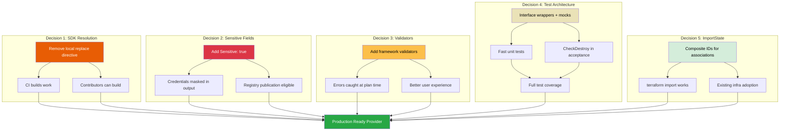

# ADR-0001: Production Readiness Hardening

## Status

Proposed

## Context

The VPSie Terraform provider (`terraform-provider-vpsie`) is built on the HashiCorp Terraform Plugin Framework v1.17.0 and manages 20 service modules comprising 27 resources and 24 data sources. A production readiness audit identified multiple categories of gaps preventing the provider from being published to the Terraform Registry or adopted with confidence by enterprise teams.

This ADR covers five interconnected architectural decisions required to bring the provider to production quality. Each decision addresses a distinct gap category but they share the common goal of aligning with HashiCorp's published provider design principles.

The full requirements context is documented in [docs/prd/production-readiness-prd.md](../prd/production-readiness-prd.md).

PRD Priority 3 (firewall error suppression) is an implementation-level correction -- replacing blank identifier `_` with proper diagnostic propagation (`diags` captured and appended via `resp.Diagnostics.Append(diags...)`) -- and does not require an architectural decision. It is therefore not covered by this ADR.

---

## Decision 1: SDK Dependency Resolution Strategy

### Decision Details

| Item | Content |
|------|---------|
| **Decision** | Remove the local `replace` directive from `go.mod` and use the published SDK version `v0.0.0-20241020152435-33a7b18a901e` |
| **Why now** | The local replace directive on line 16 of `go.mod` (`replace github.com/vpsie/govpsie => /Users/zozo/projects/govpsie`) makes the provider unbuildable for any contributor or CI environment other than the original developer's machine |
| **Why this** | The published SDK at `v0.0.0-20241020152435-33a7b18a901e` is confirmed to be functionally equivalent to the local copy; no code changes are needed beyond removing the directive and running `go mod tidy` |
| **Known unknowns** | Transitive dependency resolution may surface minor `go.sum` differences that need verification |
| **Kill criteria** | If the published SDK produces runtime failures in acceptance tests that the local copy does not, the published SDK requires a new release before this change can proceed |

### Rationale

#### Options Considered

1. **Keep the local replace directive (Status quo)**
   - Pros: No effort required; developer workflow unchanged
   - Cons: Completely blocks external contribution; CI builds fail; violates Go module publishing standards; makes the repository appear unmaintained

2. **Use `go.work` for local development (Selected approach complement)**
   - Pros: Separates development convenience from build requirements; `go.work` is gitignored by convention and does not affect CI
   - Cons: Requires developers to understand Go workspaces; adds a minor setup step
   - Note: This is complementary guidance, not the primary decision

3. **Remove the replace directive and use the published SDK (Selected)**
   - Pros: Any contributor can `git clone` and `go build` immediately; CI works without special configuration; follows Go module best practices; `go mod verify` passes cleanly
   - Cons: Developers who need to iterate on the SDK locally must use `go.work` or a temporary local replace (which must not be committed)

#### Comparison

| Evaluation Axis | Status Quo | go.work Only | Remove Replace (Selected) |
|-----------------|------------|--------------|---------------------------|
| CI Compatibility | Broken | Works | Works |
| Contributor Onboarding | Blocked | Minor setup | Zero setup |
| Implementation Effort | 0 min | 30 min | 5 min |
| Go Module Standards | Violates | Compliant | Compliant |

### Consequences

**Positive**: The provider becomes buildable from a clean clone. CI environments work without modification. The repository meets Go module publishing standards.

**Negative**: Developers iterating on the `govpsie` SDK locally must use `go.work` (gitignored) instead of a committed `replace` directive. This is a minor workflow change.

### Implementation Guidance

- Remove the `replace` directive from `go.mod`
- Run `go mod tidy` to reconcile `go.sum`
- Verify with `go build -v .` and `go mod verify`
- For local SDK development, use `go.work` (do not commit `go.work` or `go.work.sum`)

---

## Decision 2: Sensitive Field Protection Strategy

### Decision Details

| Item | Content |
|------|---------|
| **Decision** | Use `Sensitive: true` for all credential and secret fields across the provider, resources, and data sources |
| **Why now** | Five identified fields (provider `access_token`, sshkey `private_key` in resource and data source, server `initial_password` in resource and data source) currently expose plaintext secrets in `terraform plan` output, CI/CD logs, and shared terminals. Note: Some fields already have `Sensitive: true` markings (e.g., `accesstoken_resource.access_token`, `bucket_resource.access_key`/`secret_key`, `bucket_datasource.access_key`/`secret_key`, `server_resource.password` -- 6 instances across 4 files). The five fields identified here represent the remaining gaps. |
| **Why this** | `Sensitive: true` provides broad compatibility (Terraform 1.0+) while masking credentials in plan and log output, unlike `WriteOnly: true` which requires Terraform CLI 1.11+ |
| **Known unknowns** | Future Terraform CLI adoption rates for v1.11+ may shift the optimal choice toward `WriteOnly` |
| **Kill criteria** | If `Sensitive: true` is found to cause unexpected plan diffs in existing user configurations (unlikely -- it is display-only), this decision should be revisited |

### Rationale

#### Options Considered

1. **No protection (Status quo)**
   - Pros: No effort required
   - Cons: Credentials appear in plaintext in `terraform plan` output, CI logs, and any terminal sharing; violates HashiCorp provider design principles; disqualifies the provider from registry publication

2. **`Sensitive: true` on all credential fields (Selected)**
   - Pros: Broad compatibility with Terraform 1.0+; masks values as `(sensitive value)` in plan output and structured logs; display-only change with no state schema impact; works with `Computed` attributes (important for `initial_password` which is API-generated)
   - Cons: Values remain in plaintext in the Terraform state file itself; users must use encrypted remote state backends for full protection

3. **`WriteOnly: true` on credential fields**
   - Pros: Values are not persisted to state at all (strongest protection); supports ephemeral values; recommended by HashiCorp for secrets in Terraform 1.11+
   - Cons: Requires Terraform CLI 1.11+, which narrows compatibility significantly (the provider's CI tests Terraform 1.0-1.4); cannot be used with `Computed` attributes (rules out `initial_password` and sshkey `private_key` in the data source); requires configuration-based value retrieval instead of plan-based; migration from `Sensitive` to `WriteOnly` requires the `PreferWriteOnlyAttribute()` validator pattern

4. **Hybrid: `Sensitive: true` now, migrate to `WriteOnly: true` later**
   - Pros: Immediate protection with a clear upgrade path
   - Cons: Two-phase implementation; migration requires adding `PreferWriteOnlyAttribute()` validators and maintaining both attributes during the transition period
   - Note: This is the recommended long-term path but the migration belongs in a future ADR when the provider's minimum Terraform version is raised to 1.11+

#### Comparison

| Evaluation Axis | Status Quo | Sensitive (Selected) | WriteOnly | Hybrid |
|-----------------|------------|---------------------|-----------|--------|
| Terraform Compatibility | All | 1.0+ | 1.11+ only | 1.0+ now, 1.11+ later |
| State File Protection | None | None (display-only) | Full | None now, full later |
| Plan Output Protection | None | Full | Full | Full |
| Works with Computed | N/A | Yes | No | Yes now |
| Implementation Effort | 0 | 1 hour | 4 hours | 1 hour + future work |
| Breaking Change Risk | None | None | High (Computed fields) | None |

### Consequences

**Positive**: All five identified credential fields are masked in CLI output. No breaking changes to existing configurations. No state schema migration required.

**Negative**: Sensitive values remain in the Terraform state file in plaintext. This is a Terraform platform limitation. Users should be advised to use encrypted remote state backends (S3 with SSE, Azure Blob with encryption, Terraform Cloud, etc.) for state-level protection.

**Neutral**: Adding `Sensitive: true` does not change state structure or trigger resource recreation. Existing `terraform plan` output will show `(sensitive value)` where it previously showed the actual value.

### Implementation Guidance

- Apply `Sensitive: true` to the schema attribute definition for each identified field
- `Sensitive: true` is a display-only annotation; it does not affect how the value is stored or processed internally
- Document the state file limitation in provider documentation so operators are aware they need encrypted remote state backends

---

## Decision 3: Schema Validation Strategy

### Decision Details

| Item | Content |
|------|---------|
| **Decision** | Add the `terraform-plugin-framework-validators` dependency and implement validators for all `Required` attributes and meaningful `Optional` attributes |
| **Why now** | Zero validators exist across all 27 resources and 24 data sources; invalid values are only caught at API call time, producing opaque server-side error messages |
| **Why this** | Client-side validation at plan time produces clear, actionable error messages before any API call is made; the `terraform-plugin-framework-validators` library provides battle-tested, reusable validators maintained by HashiCorp |
| **Known unknowns** | Some VPSie API enum values may not be fully documented; overly restrictive validators could reject valid values |
| **Kill criteria** | If validators reject configurations that were previously accepted (breaking change), validators must be relaxed to permissive bounds |

### Rationale

#### Options Considered

1. **No validators (Status quo)**
   - Pros: No effort required; no risk of rejecting valid values
   - Cons: Users discover errors only after API calls, which are slow and produce unclear messages; empty strings pass validation for required fields; no protection against obvious mistakes

2. **Custom validators only (hand-written)**
   - Pros: Full control over validation logic; no new dependency
   - Cons: Significant implementation effort; must re-implement well-known patterns (length checks, regex matching, enum validation); higher maintenance burden; more likely to contain bugs

3. **`terraform-plugin-framework-validators` library (Selected)**
   - Pros: Maintained by HashiCorp; battle-tested in hundreds of providers; provides `stringvalidator`, `int64validator`, `float64validator`, `listvalidator`, `objectvalidator`, and `schemavalidator` packages; composable validators; well-documented
   - Cons: Adds a new dependency to `go.mod`; requires importing the correct sub-packages per attribute type

#### Comparison

| Evaluation Axis | Status Quo | Custom Validators | Framework Validators (Selected) |
|-----------------|------------|-------------------|---------------------------------|
| Implementation Effort | 0 | High (20+ hours) | Medium (8-12 hours) |
| Maintenance Burden | None | High (own code) | Low (HashiCorp-maintained) |
| Ecosystem Consistency | None | Partial | Full (standard library) |
| Error Message Quality | API errors only | Variable | Consistent, clear |
| Risk of Breaking Changes | None | Medium | Low (use permissive bounds) |

### Validator Pattern

The following validator types should be applied:

| Attribute Type | Validator | When to Apply |
|----------------|-----------|---------------|
| Required String | `stringvalidator.LengthAtLeast(1)` | All required string attributes (prevents empty strings) |
| Enum String | `stringvalidator.OneOf(...)` | Fields with known valid values (e.g., `ip_type`, `disk_format`) |
| Regex String | `stringvalidator.RegexMatches(...)` | Fields with format requirements (e.g., domain names, email patterns) |
| Required Int64 | `int64validator.AtLeast(0)` or `AtLeast(1)` | Positive-only numeric fields (e.g., `cpu`, `ram`, port numbers) |
| Optional with bounds | Type-specific range validators | Fields with known valid ranges |

### Consequences

**Positive**: Users get immediate, clear error messages at `terraform validate` and `terraform plan` time. Invalid configurations are caught before any API call. Error messages are consistent with the broader Terraform ecosystem.

**Negative**: Adds a new module dependency. Overly restrictive validators could reject valid values -- mitigate by using permissive bounds (e.g., `LengthAtLeast(1)` rather than restrictive regexes) and documenting valid values in attribute descriptions.

### Implementation Guidance

- Start with `stringvalidator.LengthAtLeast(1)` on all `Required` string attributes as a baseline (prevents empty string submission)
- Add `stringvalidator.OneOf(...)` only for fields with well-documented, stable enum values
- Use `int64validator.AtLeast(0)` or `AtLeast(1)` for numeric fields that must be non-negative or positive
- Configuration validation is "offline" (runs without provider configuration), so validators must not depend on API calls
- All validators in a `Validators` slice run regardless of whether previous validators returned errors

---

## Decision 4: Test Architecture Strategy

### Decision Details

| Item | Content |
|------|---------|
| **Decision** | Add unit tests with thin service-specific interface wrappers around `govpsie.Client` methods, plus improve existing acceptance tests with `CheckDestroy` |
| **Why now** | Only 6 of 20 services have any tests; all are acceptance tests requiring a live API and `VPSIE_ACCESS_TOKEN`; none have `CheckDestroy` functions; this means 70% of the provider has zero automated verification |
| **Why this** | Unit tests with interface-based mocks provide fast, reliable coverage without API access; service-scoped interfaces minimize abstraction overhead; `CheckDestroy` is required by HashiCorp acceptance test standards |
| **Known unknowns** | The exact surface area of `govpsie.Client` methods used per service has not been fully cataloged |
| **Kill criteria** | If interface extraction requires modifying the `govpsie` SDK itself (which is out of scope), fall back to acceptance-only testing for affected services |

### Rationale

#### Options Considered

1. **Acceptance tests only (Status quo + expansion)**
   - Pros: Tests real API behavior; no interface extraction needed; simple to write
   - Cons: Slow (minutes per test); requires live API access and valid credentials; flaky due to network/API issues; cannot run in offline CI; 6 existing tests lack `CheckDestroy`

2. **Unit tests via `httptest` (mock HTTP server)**
   - Pros: No interface changes needed; tests real HTTP serialization; runs without API access
   - Cons: Requires knowledge of exact API request/response formats; brittle to API changes; high setup effort per test; still somewhat slow; does not test at the right abstraction level

3. **Unit tests via service-specific interface wrappers (Selected)**
   - Pros: Tests business logic at the correct abstraction level; fast execution (milliseconds); runs without API access or network; interfaces are scoped per service, keeping each small and focused; standard Go mocking pattern; enables both manual mock structs and code-generated mocks (gomock, mockery)
   - Cons: Requires creating one interface per service used; adds code that exists solely for testability; `govpsie.Client` is a concrete struct, so interfaces must be extracted manually

4. **Unit tests via `gomock` on `govpsie.Client` directly**
   - Pros: No manual interface creation
   - Cons: `gomock` cannot mock concrete structs; would require modifying the `govpsie` SDK to export interfaces, which is out of scope

#### Interface Pattern

Each service defines a narrow interface covering only the SDK methods it uses:

```
Service package (e.g., server/)
  +-- server_api.go         // ServerAPI interface definition
  +-- server_resource.go    // Resource implementation (accepts ServerAPI)
  +-- server_resource_test.go // Unit tests with mock ServerAPI
```

Interfaces are scoped per service to follow the Interface Segregation Principle. A `ServerAPI` interface would only declare the 3-5 methods the server resource actually calls on `govpsie.Client`, not the entire client surface.

#### Comparison

| Evaluation Axis | Acceptance Only | httptest Mocks | Interface Wrappers (Selected) | Direct gomock |
|-----------------|----------------|----------------|-------------------------------|---------------|
| Execution Speed | Slow (minutes) | Medium (seconds) | Fast (milliseconds) | Fast |
| API Access Required | Yes | No | No | No |
| Setup Effort per Test | Low | High | Medium | N/A (not feasible) |
| Abstraction Level | E2E | HTTP | Business logic | N/A |
| SDK Modification | None | None | None (interfaces in provider) | Required (out of scope) |
| Code Overhead | None | Mock responses | ~1 interface per service | N/A |
| Maintenance | API-dependent | Response-dependent | Interface-dependent | N/A |

### Consequences

**Positive**: All 20 services can have unit tests that run in milliseconds without API access. Existing acceptance tests gain `CheckDestroy` functions, meeting HashiCorp standards. The test pyramid is properly structured with many fast unit tests and fewer slow acceptance tests.

**Negative**: Adds approximately 20 small interface files (one per service). Interface definitions must be kept in sync with `govpsie.Client` methods. This is a standard Go testing trade-off.

**Neutral**: Acceptance tests remain valuable for E2E verification. The new unit tests complement rather than replace them.

### Implementation Guidance

- Define service-specific interfaces in each service package (e.g., `ServerAPI`, `StorageAPI`)
- Each interface should declare only the methods that the specific resource and data source implementations call
- Resource structs should accept the interface type rather than `*govpsie.Client` directly; the `Configure` method assigns the concrete client which satisfies the interface
- Add `CheckDestroy` functions to all 6 existing acceptance test files
- Use table-driven tests where applicable to maximize coverage with minimal code

---

## Decision 5: ImportState Implementation for Association Resources

### Decision Details

| Item | Content |
|------|---------|
| **Decision** | Use `identifier` field for standard resources; use composite IDs in `resource_id/associated_id` format for association resources |
| **Why now** | 7 resources lack `ImportState` implementations, preventing users from importing pre-existing infrastructure into Terraform management |
| **Why this** | Single-field import uses the standard `resource.ImportStatePassthroughID` helper; composite IDs using `/` as separator are the established Terraform ecosystem convention for association resources |
| **Known unknowns** | The `dns_record` resource requires a three-part composite ID (`domain_identifier/type/name`), which is more complex than typical two-part composites |
| **Kill criteria** | If the VPSie API does not support looking up a resource by the chosen import key fields, the import implementation for that specific resource must be deferred |

### Rationale

#### Options Considered

1. **No ImportState (Status quo)**
   - Pros: No effort required
   - Cons: Users cannot import existing infrastructure; forces resource recreation to bring resources under Terraform management; blocks enterprise adoption where pre-existing infrastructure is common

2. **Single-field import for all resources**
   - Pros: Simple implementation using `resource.ImportStatePassthroughID`; consistent user experience
   - Cons: Not feasible for association resources which require multiple fields to identify the relationship (e.g., a firewall attachment needs both `group_id` and `vm_identifier`)

3. **Composite IDs with `/` separator for association resources (Selected)**
   - Pros: Established Terraform ecosystem convention (used by AWS, GCP, Azure providers); `/` separator is intuitive for hierarchical relationships; custom `ImportState` method parses and validates the composite ID; clear error messages when the format is incorrect
   - Cons: Users must know the composite ID format; slightly more complex implementation than passthrough

4. **Composite IDs with `,` separator**
   - Pros: Also a common convention in some providers; avoids potential confusion with URL-like paths
   - Cons: Less intuitive for hierarchical relationships; `/` is more widely adopted in the major cloud providers

#### Resource Import Patterns

| Resource | Import Type | Import ID Format | Import ID Example |
|----------|-------------|------------------|-------------------|
| `accesstoken` | Standard | `<identifier>` | `abc-123-def` |
| `floating_ip` | Standard | `<id>` | `fip-456` |
| `monitoring_rule` | Standard | `<identifier>` | `rule-789` |
| `firewall_attachment` | Composite | `<group_id>/<vm_identifier>` | `fw-001/vm-002` |
| `vpc_server_assignment` | Composite | `<vm_identifier>/<vpc_id>` | `vm-003/42` |
| `reverse_dns` | Composite | `<vm_identifier>/<ip>` | `vm-004/192.168.1.1` |
| `dns_record` | Composite (3-part) | `<domain_identifier>/<type>/<name>` | `dom-005/A/www` |

#### Comparison

| Evaluation Axis | No ImportState | Single-field Only | Composite `/` (Selected) | Composite `,` |
|-----------------|---------------|-------------------|--------------------------|---------------|
| User Experience | Blocked | Partial (standard only) | Full coverage | Full coverage |
| Ecosystem Consistency | N/A | High | Highest (AWS/GCP/Azure pattern) | Medium |
| Implementation Effort | 0 | Low (3 resources) | Medium (7 resources) | Medium |
| Error Handling | N/A | Simple | Requires format validation | Requires format validation |

### Consequences

**Positive**: All 27 resources will support `terraform import`. Users can adopt pre-existing VPSie infrastructure into Terraform management without recreation. The provider meets a key requirement for Terraform Registry publication.

**Negative**: Composite ID formats must be documented clearly. Users must look up the correct format for association resources. Three-part composite IDs (dns_record) are less common and may require extra documentation.

**Neutral**: ImportState implementations are additive -- they do not affect existing resource CRUD behavior or state structure.

### Implementation Guidance

- For standard resources, use `resource.ImportStatePassthroughID` with the `identifier` attribute path
- For composite ID resources, implement a custom `ImportState` method that:
  1. Splits the import ID by `/`
  2. Validates the correct number of parts and that none are empty
  3. Sets each part into the appropriate state attribute using `resp.State.SetAttribute`
  4. Returns a clear error diagnostic with the expected format if validation fails
- Add the `resource.ResourceWithImportState` interface assertion to each resource's `var _ =` block
- Include `ImportState` test steps in acceptance tests for each resource

---

## Architecture Decision Impact



---

## Related Information

- [Production Readiness PRD](../prd/production-readiness-prd.md) -- Full requirements and acceptance criteria
- [HashiCorp Terraform Plugin Best Practices](https://developer.hashicorp.com/terraform/plugin/best-practices)
- [HashiCorp Provider Design Principles](https://developer.hashicorp.com/terraform/plugin/best-practices/hashicorp-provider-design-principles)

## References

- [Terraform Plugin Framework: Write-Only Arguments](https://developer.hashicorp.com/terraform/plugin/framework/resources/write-only-arguments) - Official documentation on WriteOnly vs Sensitive attribute semantics and migration patterns
- [Terraform Plugin Framework: Validation](https://developer.hashicorp.com/terraform/plugin/framework/validation) - Official documentation on schema validation, including attribute-level and cross-attribute validators
- [terraform-plugin-framework-validators (GitHub)](https://github.com/hashicorp/terraform-plugin-framework-validators) - Common use case validators for terraform-plugin-framework
- [Terraform Plugin Framework: Resource Import](https://developer.hashicorp.com/terraform/plugin/framework/resources/import) - Official documentation on implementing ImportState with composite IDs
- [Implement Resource Import Tutorial](https://developer.hashicorp.com/terraform/tutorials/providers-plugin-framework/providers-plugin-framework-resource-import) - Step-by-step tutorial for ImportState implementation
- [Go Modules Reference](https://go.dev/ref/mod) - Official Go documentation on module management, including replace directive behavior
- [Write-Only Arguments (DeepWiki)](https://deepwiki.com/hashicorp/terraform-plugin-framework/4.3-write-only-arguments) - Detailed analysis of WriteOnly attribute patterns and migration strategies
- [Azure DevOps Provider Testing Patterns](https://github.com/microsoft/terraform-provider-azuredevops/blob/main/docs/testing.md) - Reference implementation for GoMock-based unit testing of Terraform providers
- [Terraform Provider Unit Testing Challenges (Issue #890)](https://github.com/hashicorp/terraform/issues/890) - Historical context on why interface-based mocking is the standard Go pattern for provider unit tests
