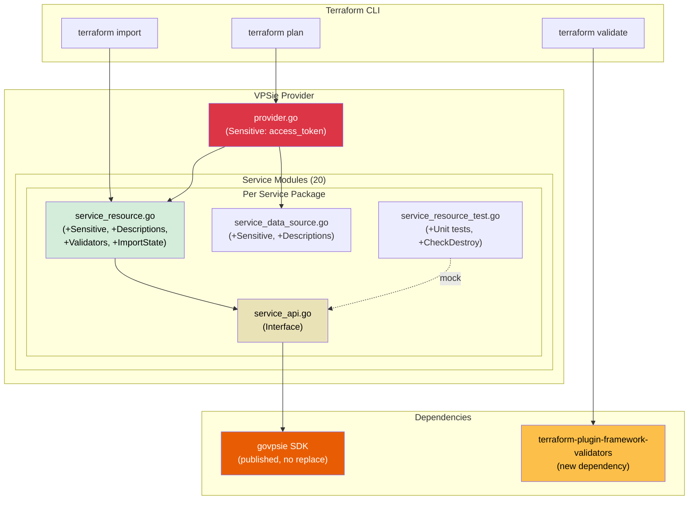
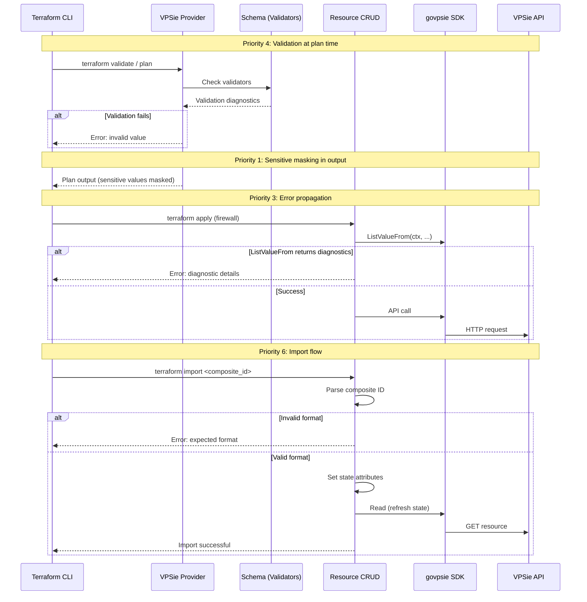
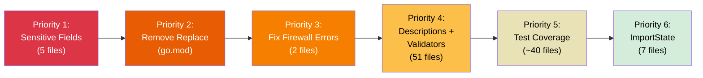

# Production Readiness Hardening Design Document

## Overview

This design document specifies the detailed implementation plan for hardening the VPSie Terraform provider to meet HashiCorp production quality standards. The effort addresses six priority areas: sensitive field markings, SDK dependency cleanup, firewall error propagation, schema documentation and validation, test coverage expansion, and ImportState implementations. The provider currently manages 20 service modules (27 resources, 24 data sources) built on `terraform-plugin-framework v1.17.0`.

## Design Summary (Meta)

```yaml
design_type: "refactoring"
risk_level: "medium"
main_constraints:
  - "govpsie SDK interface cannot be changed"
  - "Schema changes must be backward-compatible (no state migrations)"
  - "Priorities must be completed in strict order (1 through 6)"
  - "Published SDK must be functionally equivalent to local copy"
biggest_risks:
  - "Validators may reject previously accepted configurations (breaking change)"
  - "govpsie.Client is a concrete struct requiring interface wrappers for unit testing"
  - "Published SDK may have transitive dependency differences vs local copy"
unknowns:
  - "Exact valid enum values for all VPSie API fields are not fully documented"
  - "Surface area of govpsie.Client methods per service not fully cataloged"
```

## Background and Context

### Prerequisite ADRs

- [ADR-0001: Production Readiness Hardening](/Users/zozo/projects/terraform-provider-vpsie/docs/adr/ADR-0001-production-readiness-hardening.md):
  - Decision 1: Remove local replace directive, use published SDK
  - Decision 2: Use `Sensitive: true` for credential fields
  - Decision 3: Add `terraform-plugin-framework-validators` dependency
  - Decision 4: Service-specific interface wrappers for unit testing
  - Decision 5: Composite IDs with `/` separator for association resource import
- No existing common ADRs found in `docs/adr/`. This is the first ADR in the repository.

### Agreement Checklist

#### Scope
- [x] Mark 5 sensitive fields across provider.go, sshkey, and server files
- [x] Remove `replace` directive from `go.mod` and run `go mod tidy`
- [x] Fix 12 discarded error instances in firewall resource and data source
- [x] Add `MarkdownDescription` to all attributes in all 27 resources and 24 data sources
- [x] Add `terraform-plugin-framework-validators` dependency and validators to Required/meaningful attributes
- [x] Create service-specific interface wrappers and unit tests for 14 untested services
- [x] Add `CheckDestroy` to 6 existing acceptance test files
- [x] Add `ImportState` to 7 resources missing it

#### Non-Scope (Explicitly not changing)
- [x] No modifications to the `govpsie` SDK
- [x] No new resources or data sources
- [x] No state schema migrations
- [x] No CI/CD pipeline changes
- [x] No performance optimizations
- [x] No `WriteOnly: true` migration (deferred per ADR Decision 2)
- [x] No rename of `storage_snapshot_data_resource.go` (tracked separately)

#### Constraints
- [x] Parallel operation: No (strict sequential priority execution)
- [x] Backward compatibility: Required (Sensitive, descriptions, validators, ImportState are all additive)
- [x] Performance measurement: Not required (no performance-related changes)

### Design Agreement Verification
- [x] Each agreement is reflected in the design sections below
- [x] No design contradicts agreements
- [x] All scope items map to specific implementation sections

### Problem to Solve

The VPSie Terraform provider has six categories of production-quality gaps:

1. **Credential exposure**: 5 sensitive fields (access_token, private_key x2, initial_password x2) appear in plaintext in `terraform plan` output and CI logs
2. **Build portability**: A local filesystem `replace` directive in `go.mod` prevents anyone except the original developer from building the provider
3. **Silent errors**: 12 `ListValueFrom` calls in firewall code silently discard diagnostics, masking data corruption
4. **No documentation**: Zero `MarkdownDescription` values across all schema attributes; zero validators on any attributes
5. **Minimal test coverage**: Only 6/20 services have tests; none have `CheckDestroy`; 14 services have zero automated verification
6. **Incomplete import support**: 7/27 resources lack `ImportState`, blocking adoption of existing infrastructure

### Requirements

#### Functional Requirements

See [PRD](/Users/zozo/projects/terraform-provider-vpsie/docs/prd/production-readiness-prd.md) FR-1.1 through FR-6.7.

#### Non-Functional Requirements

- **Security**: All credential/secret fields masked as `(sensitive value)` in plan output
- **Reliability**: Zero silently discarded errors in resource/data source code
- **Build Reproducibility**: Provider builds from clean `git clone` with Go 1.24+
- **Documentation**: 100% of schema attributes have non-empty `MarkdownDescription`
- **Test Coverage**: All 20 service modules have unit tests; all acceptance tests have `CheckDestroy`

## Acceptance Criteria (AC) - EARS Format

### Priority 1: Sensitive Field Markings

- [x] **AC-1.1**: **When** a Terraform plan includes the provider configuration, the system shall display the `access_token` value as `(sensitive value)` in plan output.
- [x] **AC-1.2**: **When** a Terraform plan creates or reads an `sshkey` resource, the system shall display the `private_key` value as `(sensitive value)`.
- [x] **AC-1.3**: **When** a Terraform plan reads the sshkeys data source, the system shall display each `private_key` value as `(sensitive value)`.
- [x] **AC-1.4**: **When** a Terraform plan reads the servers data source, the system shall display each `initial_password` value as `(sensitive value)`.
- [x] **AC-1.5**: **When** a Terraform plan creates or reads a server resource, the system shall display the `initial_password` value as `(sensitive value)`.

### Priority 2: Remove Local SDK Replace Directive

- [x] **AC-2.1**: **When** `go build -v .` is executed on a clean clone, the system shall build successfully using the published SDK from the Go module proxy.
- [x] **AC-2.2**: **When** `go mod tidy` is run after removing the replace directive, the system shall produce no errors and `go.sum` shall reflect published checksums.
- [x] **AC-2.3**: **When** `go mod verify` is run, the system shall report all modules verified.

### Priority 3: Fix Firewall Error Suppression

- [x] **AC-3.1**: **When** a `ListValueFrom` call returns a diagnostic error in `firewall_resource.go` Create method, the system shall append the error to `resp.Diagnostics` and halt the operation.
- [x] **AC-3.2**: **When** a `ListValueFrom` call returns a diagnostic error in `firewall_resource.go` Read method, the system shall append the error to `resp.Diagnostics` and halt the operation.
- [x] **AC-3.3**: **When** a `ListValueFrom` call returns a diagnostic error in `firewall_data_source.go` Read method, the system shall append the error to `resp.Diagnostics` and halt the operation.
- [x] **AC-3.4**: The provider codebase shall contain zero instances of `_, _ :=` or `_, _` patterns discarding diagnostics from type-conversion calls.

### Priority 4: Schema Validators and Descriptions

- [x] **AC-4.1**: Every attribute in all 27 resources and 24 data sources shall have a non-empty `MarkdownDescription`.
- [x] **AC-4.2**: **When** `terraform providers schema -json` is run, every attribute shall report a description.
- [x] **AC-4.3**: **When** a Terraform configuration provides an empty string for a Required string attribute, `terraform validate` shall return a validation error before any API call.
- [x] **AC-4.4**: **When** a Terraform configuration provides an invalid value for a validated Optional attribute (e.g., invalid `ip_type`), `terraform validate` shall return a validation error.
- [x] **AC-4.5**: **When** `go generate ./...` is run after all descriptions are added, the `docs/` directory shall contain up-to-date documentation with attribute descriptions.

### Priority 5: Test Coverage

- [x] **AC-5.1**: **When** `go test ./...` is run (without `TF_ACC=1`), unit tests shall exist and pass for all 20 service modules.
- [x] **AC-5.2**: Each existing acceptance test shall include a `CheckDestroy` function that verifies the resource no longer exists in the VPSie API after test completion.
- [x] **AC-5.3**: Each service-specific interface wrapper shall declare only the SDK methods used by that service's resource and data source implementations.

### Priority 6: ImportState Implementations

- [x] **AC-6.1**: **When** `terraform import vpsie_access_token.example <identifier>` is run with a known identifier, the system shall successfully import the resource into state.
- [x] **AC-6.2**: **When** `terraform import vpsie_firewall_attachment.example <group_id>/<vm_identifier>` is run, the system shall parse the composite ID and import the resource.
- [x] **AC-6.3**: **When** `terraform import vpsie_floating_ip.example <id>` is run, the system shall successfully import the resource into state.
- [x] **AC-6.4**: **When** `terraform import vpsie_vpc_server_assignment.example <vm_identifier>/<vpc_id>` is run, the system shall parse the composite ID and import the resource.
- [x] **AC-6.5**: **When** `terraform import vpsie_monitoring_rule.example <identifier>` is run, the system shall successfully import the resource into state.
- [x] **AC-6.6**: **When** `terraform import vpsie_reverse_dns.example <vm_identifier>/<ip>` is run, the system shall parse the composite ID and import the resource.
- [x] **AC-6.7**: **When** `terraform import vpsie_dns_record.example <domain_identifier>/<type>/<name>` is run, the system shall parse the 3-part composite ID and import the resource.
- [x] **AC-6.8**: **If** a composite ID has an incorrect number of parts or empty segments, **then** the system shall return a clear error diagnostic specifying the expected format.

## Existing Codebase Analysis

### Implementation Path Mapping

| Type | Path | Description |
|------|------|-------------|
| Existing | `internal/provider/provider.go` | Provider schema with `access_token` (needs Sensitive) |
| Existing | `internal/services/sshkey/sshkey_resource.go` | SSH key resource (needs Sensitive on `private_key`) |
| Existing | `internal/services/sshkey/sshkey_data_source.go` | SSH keys data source (needs Sensitive on `private_key`) |
| Existing | `internal/services/server/server_resource.go` | Server resource (needs Sensitive on `initial_password`) |
| Existing | `internal/services/server/server_data_source.go` | Server data source (needs Sensitive on `initial_password`) |
| Existing | `go.mod` | Contains replace directive on line 16 |
| Existing | `internal/services/firewall/firewall_resource.go` | Lines 394-395, 421-422, 508-509, 535-536 discard errors |
| Existing | `internal/services/firewall/firewall_data_source.go` | Lines 332-333, 359-360 discard errors |
| Existing | `internal/services/accesstoken/accesstoken_resource.go` | Missing ImportState |
| Existing | `internal/services/firewall/firewall_attachment_resource.go` | Missing ImportState |
| Existing | `internal/services/fip/fip_resource.go` | Missing ImportState |
| Existing | `internal/services/vpc/vpc_server_assignment_resource.go` | Missing ImportState |
| Existing | `internal/services/monitoring/monitoring_rule_resource.go` | Missing ImportState |
| Existing | `internal/services/domain/reverse_dns_resource.go` | Missing ImportState |
| Existing | `internal/services/domain/dns_record_resource.go` | Missing ImportState |
| New | `internal/services/<service>/<service>_api.go` | Service-specific interface wrappers (1 per service, ~20 files) |
| New | `internal/services/<service>/<service>_resource_test.go` | Unit tests for untested services (14 files) |
| Existing (modify) | 27 resource files + 24 data source files | Add MarkdownDescription and validators |
| Existing (modify) | 6 existing test files | Add CheckDestroy functions |

### Complete File Inventory

**Resources (27 files):**

| # | Service | File | Has ImportState | Has Tests |
|---|---------|------|-----------------|-----------|
| 1 | accesstoken | `accesstoken_resource.go` | No | Yes |
| 2 | backup | `backup_resource.go` | Yes | No |
| 3 | backup | `backup_policy_resource.go` | Yes | No |
| 4 | bucket | `bucket_resource.go` | Yes | No |
| 5 | domain | `domain_resource.go` | Yes | Yes |
| 6 | domain | `dns_record_resource.go` | No | No |
| 7 | domain | `reverse_dns_resource.go` | No | No |
| 8 | fip | `fip_resource.go` | No | No |
| 9 | firewall | `firewall_resource.go` | Yes | No |
| 10 | firewall | `firewall_attachment_resource.go` | No | No |
| 11 | gateway | `gateway_resource.go` | Yes | No |
| 12 | image | `image_resource.go` | Yes | No |
| 13 | kubernetes | `kubernetes_resource.go` | Yes | No |
| 14 | kubernetes | `kubernetes_group_resource.go` | Yes | No |
| 15 | loadbalancer | `loadbalancer_resource.go` | Yes | No |
| 16 | monitoring | `monitoring_rule_resource.go` | No | No |
| 17 | project | `project_resource.go` | Yes | Yes |
| 18 | script | `script_resource.go` | Yes | Yes |
| 19 | server | `server_resource.go` | Yes | No |
| 20 | snapshot | `server_snapshot_resource.go` | Yes | No |
| 21 | snapshot | `snapshot_policy_resource.go` | Yes | No |
| 22 | sshkey | `sshkey_resource.go` | Yes | Yes |
| 23 | storage | `storage_resource.go` | Yes | Yes |
| 24 | storage | `storage_attachment_resource.go` | Yes | No |
| 25 | storage | `storage_snapshot_resource.go` | Yes | No |
| 26 | vpc | `vpc_resource.go` | Yes | No |
| 27 | vpc | `vpc_server_assignment_resource.go` | No | No |

**Data Sources (24 files):**

| # | Service | File |
|---|---------|------|
| 1 | accesstoken | `accesstoken_datasource.go` |
| 2 | backup | `backup_data_source.go` |
| 3 | backup | `backup_policy_datasource.go` |
| 4 | bucket | `bucket_datasource.go` |
| 5 | datacenter | `datacenter_datasource.go` |
| 6 | domain | `domain_data_source.go` |
| 7 | fip | `fip_datasource.go` |
| 8 | firewall | `firewall_data_source.go` |
| 9 | gateway | `gateway_data_source.go` |
| 10 | image | `image_data_source.go` |
| 11 | ip | `ip_datasource.go` |
| 12 | kubernetes | `kubernetes_data_source.go` |
| 13 | kubernetes | `kubernetes_group_data_source.go` |
| 14 | loadbalancer | `loadbalancer_data_source.go` |
| 15 | monitoring | `monitoring_rule_datasource.go` |
| 16 | project | `project_data_source.go` |
| 17 | script | `script_data_source.go` |
| 18 | server | `server_data_source.go` |
| 19 | snapshot | `server_snapshot_data_source.go` |
| 20 | snapshot | `snapshot_policy_datasource.go` |
| 21 | sshkey | `sshkey_data_source.go` |
| 22 | storage | `storage_data_source.go` |
| 23 | storage | `storage_snapshot_data_resource.go` (confirmed data source despite name) |
| 24 | vpc | `vpc_data_source.go` |

### Similar Functionality Search

- **Sensitive markings**: Found existing `Sensitive: true` usage in `accesstoken_resource.go` (`access_token`), `bucket_resource.go` (`access_key`, `secret_key`), `bucket_datasource.go` (`access_key`, `secret_key`), `server_resource.go` (`password`). These 6 existing instances confirm the pattern is already used in the codebase. The 5 gaps are the additions needed.
- **ImportState**: Found existing implementations using `resource.ImportStatePassthroughID` in 20 resources (e.g., `sshkey_resource.go`, `bucket_resource.go`). The 7 missing resources follow the same pattern or need composite ID parsing.
- **Error handling pattern**: All other resource/data source files properly handle diagnostics. Only firewall files have the blank identifier pattern.
- **Validators**: Zero validator usage found across the entire codebase. This is a net-new addition.
- **Unit test interfaces**: No service-specific interface files exist. This is a net-new pattern.

**Decision**: Extend existing patterns (Sensitive, ImportState passthrough) and introduce new patterns (validators, interface wrappers) following ADR-0001 decisions.

## Design

### Architecture Overview



### Change Impact Map

```yaml
Priority 1 - Sensitive Fields:
  Change Target: Schema attribute definitions in 5 files
  Direct Impact:
    - internal/provider/provider.go (access_token attribute)
    - internal/services/sshkey/sshkey_resource.go (private_key attribute)
    - internal/services/sshkey/sshkey_data_source.go (private_key attribute)
    - internal/services/server/server_data_source.go (initial_password attribute)
    - internal/services/server/server_resource.go (initial_password attribute)
  Indirect Impact:
    - terraform plan output changes from plaintext to "(sensitive value)"
  No Ripple Effect:
    - State file format unchanged
    - CRUD operations unchanged
    - Other resources/data sources unaffected

Priority 2 - SDK Replace Directive:
  Change Target: go.mod line 16
  Direct Impact:
    - go.mod (remove replace directive)
    - go.sum (checksums updated by go mod tidy)
  Indirect Impact:
    - Build system fetches from module proxy instead of local path
  No Ripple Effect:
    - All Go source code unchanged
    - All resource/data source behavior unchanged

Priority 3 - Firewall Error Suppression:
  Change Target: ListValueFrom calls in firewall code
  Direct Impact:
    - internal/services/firewall/firewall_resource.go (lines 394-395, 421-422, 508-509, 535-536)
    - internal/services/firewall/firewall_data_source.go (lines 332-333, 359-360)
  Indirect Impact:
    - Terraform will now surface errors that were previously silent
    - Users may see new error messages for previously "working" configs with bad data
  No Ripple Effect:
    - Other services unaffected
    - Firewall schema unchanged

Priority 4 - Validators and Descriptions:
  Change Target: Schema definitions in all 51 resource/data source files
  Direct Impact:
    - 27 resource files (add MarkdownDescription + validators)
    - 24 data source files (add MarkdownDescription)
    - go.mod (add terraform-plugin-framework-validators dependency)
  Indirect Impact:
    - terraform providers schema -json output gains descriptions
    - terraform validate catches invalid values earlier
    - docs/ regenerated with descriptions
  No Ripple Effect:
    - CRUD operations unchanged
    - State format unchanged

Priority 5 - Test Coverage:
  Change Target: Test infrastructure
  Direct Impact:
    - 14 new unit test files
    - ~20 new interface definition files
    - 6 existing test files (add CheckDestroy)
  Indirect Impact:
    - Resource struct fields change from *govpsie.Client to sub-service interface type
    - Configure method updated to extract sub-service (e.g., s.client = client.Storage)
    - CRUD method call sites drop sub-service prefix (e.g., s.client.Storage.Get -> s.client.Get)
  No Ripple Effect:
    - Runtime behavior unchanged (sub-service interfaces satisfied by concrete sub-service structs)
    - Schema and state unchanged

Priority 6 - ImportState:
  Change Target: 7 resource files
  Direct Impact:
    - accesstoken_resource.go (add ImportState + interface assertion)
    - firewall_attachment_resource.go (add ImportState + interface assertion)
    - fip_resource.go (add ImportState + interface assertion)
    - vpc_server_assignment_resource.go (add ImportState + interface assertion)
    - monitoring_rule_resource.go (add ImportState + interface assertion)
    - reverse_dns_resource.go (add ImportState + interface assertion)
    - dns_record_resource.go (add ImportState + interface assertion)
  Indirect Impact:
    - terraform import command becomes available for these resources
  No Ripple Effect:
    - Existing CRUD operations unchanged
    - Schema unchanged
    - State format unchanged
```

### Data Flow



### Integration Points List

| Integration Point | Location | Old Implementation | New Implementation | Switching Method |
|-------------------|----------|-------------------|-------------------|------------------|
| Provider access_token schema | `provider.go` line 69-72 | `schema.StringAttribute{Optional: true}` | Add `Sensitive: true` | Direct attribute modification |
| SSH key private_key schema (resource) | `sshkey_resource.go` line 73-78 | `schema.StringAttribute{Required: true}` | Add `Sensitive: true` | Direct attribute modification |
| SSH key private_key schema (data source) | `sshkey_data_source.go` line 66-67 | `schema.StringAttribute{Computed: true}` | Add `Sensitive: true` | Direct attribute modification |
| Server initial_password (data source) | `server_data_source.go` line 174-176 | `schema.StringAttribute{Computed: true}` | Add `Sensitive: true` | Direct attribute modification |
| Server initial_password (resource) | `server_resource.go` line 312-317 | `schema.StringAttribute{Computed: true}` | Add `Sensitive: true` | Direct attribute modification |
| go.mod SDK resolution | `go.mod` line 16 | `replace github.com/vpsie/govpsie => local` | Remove line | Delete directive |
| Firewall ListValueFrom | `firewall_resource.go` 4 locations | `val, _ := types.ListValueFrom(...)` | `val, diags := ...; resp.Diagnostics.Append(diags...)` | Replace error handling |
| Resource struct client field | All 20 service packages | `client *govpsie.Client` (calls `client.SubService.Method()`) | `client ServiceAPI` (interface wrapping sub-service; Configure extracts `client.SubService`) | Interface extraction + sub-service assignment |
| ImportState for 7 resources | 7 resource files | Not implemented | Add `ImportState` method + interface assertion | Add method + var assertion |

### Integration Point Map

```yaml
Integration Point 1:
  Existing Component: provider.go Schema() method, access_token attribute
  Integration Method: Add Sensitive field to existing attribute definition
  Impact Level: Low (Display-only change)
  Required Test Coverage: Verify plan output masks access_token

Integration Point 2:
  Existing Component: go.mod replace directive
  Integration Method: Delete line, run go mod tidy
  Impact Level: High (Build system change)
  Required Test Coverage: go build, go mod verify, full acceptance test suite

Integration Point 3:
  Existing Component: firewall_resource.go Create() and Read() methods
  Integration Method: Replace blank identifier with diagnostic capture
  Impact Level: Medium (Error surfacing change)
  Required Test Coverage: Unit test with mock that triggers ListValueFrom error

Integration Point 4:
  Existing Component: All resource/data source Schema() methods
  Integration Method: Add MarkdownDescription and Validators fields
  Impact Level: Low (Additive schema metadata)
  Required Test Coverage: terraform providers schema -json inspection

Integration Point 5:
  Existing Component: Resource struct client fields (currently *govpsie.Client, calls client.SubService.Method())
  Integration Method: Change struct field to sub-service interface type, Configure extracts sub-service from *govpsie.Client, add _api.go files
  Impact Level: Medium (Type signature change + CRUD call site prefix removal)
  Required Test Coverage: Unit tests with mocked sub-service interfaces

Integration Point 6:
  Existing Component: 7 resource structs (var declarations)
  Integration Method: Add ResourceWithImportState interface assertion and ImportState method
  Impact Level: Low (Additive lifecycle method)
  Required Test Coverage: ImportState acceptance test steps
```

### Integration Boundary Contracts

```yaml
Boundary: Sensitive Field Marking
  Input: Schema attribute definition with Sensitive: true
  Output: Plan output displays "(sensitive value)" (synchronous)
  On Error: Not applicable (compile-time, no runtime error possible)

Boundary: SDK Dependency Resolution
  Input: go.mod without replace directive
  Output: go build fetches published module (synchronous)
  On Error: Build failure if published module unavailable; fallback is to re-add replace temporarily

Boundary: Firewall Error Propagation
  Input: ListValueFrom call returns diag.Diagnostics
  Output: Diagnostics appended to resp.Diagnostics (synchronous)
  On Error: If diagnostics contain errors, CRUD method returns early; Terraform surfaces error to user

Boundary: Schema Validation
  Input: User-provided Terraform configuration values
  Output: Validation diagnostics (synchronous, pre-API-call)
  On Error: Validation errors prevent plan/apply; user sees actionable error message

Boundary: Service Interface Wrapper
  Input: Resource CRUD methods call sub-service interface methods (e.g., s.client.CreateVolume())
  Output: Interface delegates to govpsie sub-service (e.g., client.Storage) at runtime (synchronous)
  On Error: SDK errors propagated unchanged through interface

Boundary: ImportState Composite ID Parsing
  Input: String from terraform import command (e.g., "group_id/vm_id")
  Output: Parsed parts set into state attributes (synchronous)
  On Error: Return diagnostic with expected format string
```

---

## Priority 1: Sensitive Field Markings -- Detailed Design

### Files and Exact Changes

**1. `internal/provider/provider.go` -- `access_token` attribute**

Current (line 69-72):
```go
"access_token": schema.StringAttribute{
    MarkdownDescription: "VPSie API access token. Can also be set with the `VPSIE_ACCESS_TOKEN` environment variable.",
    Optional:            true,
},
```

Change to:
```go
"access_token": schema.StringAttribute{
    MarkdownDescription: "VPSie API access token. Can also be set with the `VPSIE_ACCESS_TOKEN` environment variable.",
    Optional:            true,
    Sensitive:           true,
},
```

**2. `internal/services/sshkey/sshkey_resource.go` -- `private_key` attribute**

Current (line 73-78):
```go
"private_key": schema.StringAttribute{
    Required: true,
    PlanModifiers: []planmodifier.String{
        stringplanmodifier.RequiresReplace(),
    },
},
```

Change to:
```go
"private_key": schema.StringAttribute{
    Required:  true,
    Sensitive: true,
    PlanModifiers: []planmodifier.String{
        stringplanmodifier.RequiresReplace(),
    },
},
```

**3. `internal/services/sshkey/sshkey_data_source.go` -- `private_key` attribute**

Current (line 66-67):
```go
"private_key": schema.StringAttribute{
    Computed: true,
},
```

Change to:
```go
"private_key": schema.StringAttribute{
    Computed:  true,
    Sensitive: true,
},
```

**4. `internal/services/server/server_data_source.go` -- `initial_password` attribute**

Current (line 174-176):
```go
"initial_password": schema.StringAttribute{
    Computed: true,
},
```

Change to:
```go
"initial_password": schema.StringAttribute{
    Computed:  true,
    Sensitive: true,
},
```

**5. `internal/services/server/server_resource.go` -- `initial_password` attribute**

Current (line 312-317):
```go
"initial_password": schema.StringAttribute{
    Computed: true,
    PlanModifiers: []planmodifier.String{
        stringplanmodifier.UseStateForUnknown(),
    },
},
```

Change to:
```go
"initial_password": schema.StringAttribute{
    Computed:  true,
    Sensitive: true,
    PlanModifiers: []planmodifier.String{
        stringplanmodifier.UseStateForUnknown(),
    },
},
```

### Verification

After applying changes, grep verification:
```bash
grep -rn "Sensitive:" internal/provider/provider.go internal/services/sshkey/ internal/services/server/
```
Expected: 5 new `Sensitive: true` lines plus the 6 existing ones in other files.

---

## Priority 2: Remove SDK Replace Directive -- Detailed Design

### Files and Exact Changes

**1. `go.mod` -- Remove line 16**

Current line 16:
```
replace github.com/vpsie/govpsie => /Users/zozo/projects/govpsie
```

Action: Delete this entire line.

**2. Run `go mod tidy`**

```bash
cd /Users/zozo/projects/terraform-provider-vpsie
go mod tidy
```

This will update `go.sum` to reflect the published SDK checksums.

### Verification

```bash
go build -v .
go mod verify
```

Both must succeed. The `go.mod` file must contain zero `replace` directives.

---

## Priority 3: Fix Firewall Error Suppression -- Detailed Design

### Pattern Transformation

**Before** (discarded error):
```go
dest_list, _ := types.ListValueFrom(ctx, types.StringType, dest)
source_list, _ := types.ListValueFrom(ctx, types.StringType, source)
```

**After** (propagated error):
```go
dest_list, diags := types.ListValueFrom(ctx, types.StringType, dest)
resp.Diagnostics.Append(diags...)
source_list, diags := types.ListValueFrom(ctx, types.StringType, source)
resp.Diagnostics.Append(diags...)
if resp.Diagnostics.HasError() {
    return
}
```

Note: The second assignment uses `diags :=` (not `=`) because in Go each `:=` in a new line within the same scope is acceptable when at least one variable on the left is new. However, since `diags` is already declared by the first call, the second must use `=` assignment. The correct pattern:

```go
dest_list, diags := types.ListValueFrom(ctx, types.StringType, dest)
resp.Diagnostics.Append(diags...)
source_list, diagsSource := types.ListValueFrom(ctx, types.StringType, source)
resp.Diagnostics.Append(diagsSource...)
if resp.Diagnostics.HasError() {
    return
}
```

Alternatively, reuse `diags` with plain assignment after the first short declaration:

```go
dest_list, diags := types.ListValueFrom(ctx, types.StringType, dest)
resp.Diagnostics.Append(diags...)
var source_list types.List
source_list, diags = types.ListValueFrom(ctx, types.StringType, source)
resp.Diagnostics.Append(diags...)
if resp.Diagnostics.HasError() {
    return
}
```

The simplest correct approach for each pair:

```go
destList, destDiags := types.ListValueFrom(ctx, types.StringType, dest)
resp.Diagnostics.Append(destDiags...)
sourceList, sourceDiags := types.ListValueFrom(ctx, types.StringType, source)
resp.Diagnostics.Append(sourceDiags...)
if resp.Diagnostics.HasError() {
    return
}
```

### Exact Locations

**`internal/services/firewall/firewall_resource.go`:**

| Location | Method | Lines | InBound/OutBound |
|----------|--------|-------|------------------|
| 1 | Create | 394-395 | InBound rules |
| 2 | Create | 421-422 | OutBound rules |
| 3 | Read | 508-509 | InBound rules |
| 4 | Read | 535-536 | OutBound rules |

**`internal/services/firewall/firewall_data_source.go`:**

| Location | Method | Lines | InBound/OutBound |
|----------|--------|-------|------------------|
| 5 | Read | 332-333 | InBound rules |
| 6 | Read | 359-360 | OutBound rules |

Total: 12 `ListValueFrom` calls across 6 pairs to fix.

### Verification

```bash
grep -rn '_, _ :=' internal/services/firewall/
grep -rn '_, _\s*=' internal/services/firewall/
```
Both must return zero results.

---

## Priority 4: Schema Validators and Descriptions -- Detailed Design

### New Dependency

Add to `go.mod` required block:
```
github.com/hashicorp/terraform-plugin-framework-validators v0.17.0
```

Run:
```bash
go get github.com/hashicorp/terraform-plugin-framework-validators@v0.17.0
go mod tidy
```

### Description Strategy

Every attribute in every resource and data source must receive a `MarkdownDescription` field. The description should:

1. Explain what the attribute represents in 1-2 sentences
2. For enum fields, list valid values
3. For identifier fields, note whether it is VPSie-generated or user-provided
4. For Computed fields, note that the value is set by the API

Example patterns:
```go
// Required user-provided attribute
"name": schema.StringAttribute{
    MarkdownDescription: "The name of the storage volume. Must be unique within the account.",
    Required: true,
},

// Computed API-generated attribute
"identifier": schema.StringAttribute{
    MarkdownDescription: "The unique identifier of the resource, assigned by the VPSie API.",
    Computed: true,
},

// Enum attribute
"disk_format": schema.StringAttribute{
    MarkdownDescription: "The filesystem format for the storage volume. Valid values: `EXT4`, `XFS`.",
    Required: true,
},
```

### Validator Strategy

**Import additions** (added to each resource file as needed):
```go
import (
    "github.com/hashicorp/terraform-plugin-framework-validators/stringvalidator"
    "github.com/hashicorp/terraform-plugin-framework-validators/int64validator"
)
```

**Validator application rules:**

| Attribute Type | Condition | Validator |
|----------------|-----------|-----------|
| Required String | All | `stringvalidator.LengthAtLeast(1)` |
| Required String (enum) | Known valid values | `stringvalidator.OneOf("value1", "value2", ...)` |
| Required String (name) | Pattern requirement | `stringvalidator.LengthAtLeast(1)` (keep permissive) |
| Required Int64 (positive) | Must be > 0 | `int64validator.AtLeast(1)` |
| Required Int64 (non-negative) | Must be >= 0 | `int64validator.AtLeast(0)` |
| Optional String (enum) | Known valid values | `stringvalidator.OneOf(...)` |
| Optional Int64 (range) | Known range | `int64validator.Between(min, max)` |

**Example validator addition:**
```go
"name": schema.StringAttribute{
    MarkdownDescription: "The name of the SSH key.",
    Required: true,
    PlanModifiers: []planmodifier.String{
        stringplanmodifier.RequiresReplace(),
    },
    Validators: []validator.String{
        stringvalidator.LengthAtLeast(1),
    },
},
```

**Known enum fields requiring `OneOf` validators:**

| Service | Attribute | Known Valid Values |
|---------|-----------|-------------------|
| fip | `ip_type` | `"ipv4"`, `"ipv6"` |
| storage | `disk_format` | `"EXT4"`, `"XFS"` |
| storage | `storage_type` | `"standard"`, `"ssd"` |
| monitoring | `metric_type` | Values to be confirmed from API docs |
| monitoring | `condition` | `">"`, `"<"`, `">="`, `"<="`, `"=="` |
| dns_record | `type` | `"A"`, `"AAAA"`, `"CNAME"`, `"MX"`, `"TXT"`, `"NS"`, `"SRV"` |

**Important**: Use permissive validators to avoid breaking existing configurations. When in doubt, use `LengthAtLeast(1)` over restrictive enums.

### Scope of Changes

All 51 files (27 resources + 24 data sources) need `MarkdownDescription` additions. Only resource files with Required or meaningful Optional attributes need validators. Data source attributes are typically all Computed and do not need validators.

### Documentation Regeneration

After all descriptions are added:
```bash
go generate ./...
```

This runs `terraform fmt -recursive ./examples/` and `tfplugindocs` to regenerate `docs/`.

---

## Priority 5: Test Coverage -- Detailed Design

### Interface Wrapper Pattern (per ADR Decision 4)

For each service package, create a `<service>_api.go` file defining a narrow interface.

**Important clarification**: The `govpsie.Client` struct exposes sub-service fields (e.g., `client.Storage`, `client.Server`, `client.Domain`). Resource code accesses these as `s.client.Storage.CreateVolume(...)`. The service-specific interface wraps the **sub-service** (e.g., `client.Storage`), NOT the entire `*govpsie.Client`. The resource struct receives `*govpsie.Client` in `Configure` and extracts the sub-service to assign to the interface field.

**Example: `internal/services/storage/storage_api.go`**

```go
package storage

import (
    "context"
    "github.com/vpsie/govpsie"
)

// StorageAPI defines the govpsie Storage sub-service methods used by the
// storage resource and data source. It enables unit testing with mock
// implementations.
//
// This interface wraps client.Storage (the sub-service), not *govpsie.Client.
type StorageAPI interface {
    ListVolumes(ctx context.Context, options *govpsie.ListOptions) ([]govpsie.Volume, error)
    GetVolume(ctx context.Context, identifier string) (*govpsie.Volume, error)
    CreateVolume(ctx context.Context, req *govpsie.StorageCreateRequest) error
    DeleteVolume(ctx context.Context, identifier string) error
    // Add other methods as discovered during implementation
}
```

**Resource struct change:**

Before:
```go
type storageResource struct {
    client *govpsie.Client
}
```

After:
```go
type storageResource struct {
    client StorageAPI
}
```

**Configure method -- extract sub-service from full client:**

The `Configure` method still receives `*govpsie.Client` from provider data, then extracts the sub-service field:

```go
func (s *storageResource) Configure(_ context.Context, req resource.ConfigureRequest, resp *resource.ConfigureResponse) {
    // ...
    client, ok := req.ProviderData.(*govpsie.Client)
    // ...
    s.client = client.Storage  // Extract Storage sub-service; satisfies StorageAPI
}
```

After this change, resource CRUD code drops the sub-service prefix:
- Before: `s.client.Storage.CreateVolume(ctx, req)`
- After: `s.client.CreateVolume(ctx, req)`

### Interface Discovery Process

For each of the 20 service packages:
1. Read the resource and data source files
2. Identify all `s.client.<SubService>.MethodName(...)` calls (e.g., `s.client.Storage.CreateVolume`)
3. Define the interface with exactly those method signatures from the sub-service
4. The interface methods must match the `govpsie` sub-service method signatures exactly (e.g., methods on `client.Storage`, not on `*govpsie.Client` itself)

### Unit Test Pattern

The mock implements the sub-service interface (e.g., `StorageAPI`), not the full `*govpsie.Client`.

**Example: `internal/services/storage/storage_resource_test.go`**

```go
package storage

import (
    "context"
    "testing"
    "github.com/vpsie/govpsie"
)

// mockStorageAPI implements StorageAPI (the Storage sub-service interface)
type mockStorageAPI struct {
    listFn   func(ctx context.Context, options *govpsie.ListOptions) ([]govpsie.Volume, error)
    getFn    func(ctx context.Context, identifier string) (*govpsie.Volume, error)
    createFn func(ctx context.Context, req *govpsie.StorageCreateRequest) error
    deleteFn func(ctx context.Context, identifier string) error
}

func (m *mockStorageAPI) ListVolumes(ctx context.Context, options *govpsie.ListOptions) ([]govpsie.Volume, error) {
    return m.listFn(ctx, options)
}
// ... implement other interface methods

func TestStorageResource_Create_Success(t *testing.T) {
    mock := &mockStorageAPI{
        createFn: func(ctx context.Context, req *govpsie.StorageCreateRequest) error {
            return nil
        },
        // ... setup other mock methods
    }

    // Use mock in resource test
    _ = mock // Table-driven test structure
}
```

### Services Requiring New Tests (14)

Each interface wraps the corresponding `govpsie.Client` sub-service field (e.g., `BackupAPI` wraps `client.Backup`).

| Service | Interface Name | Wraps Sub-Service | Estimated Methods |
|---------|---------------|-------------------|-------------------|
| backup | BackupAPI | `client.Backup` | 3-5 |
| bucket | BucketAPI | `client.Bucket` | 3-5 |
| datacenter | DatacenterAPI | `client.DataCenter` | 1-2 |
| fip | FipAPI | `client.FIP` | 3-4 |
| firewall | FirewallAPI | `client.Firewall` | 4-6 |
| gateway | GatewayAPI | `client.Gateway` | 3-5 |
| image | ImageAPI | `client.Image` | 3-5 |
| ip | IpAPI | `client.IP` | 1-2 |
| kubernetes | KubernetesAPI | `client.Kubernetes` | 4-6 |
| loadbalancer | LoadbalancerAPI | `client.LB` | 3-5 |
| monitoring | MonitoringAPI | `client.Monitoring` | 3-5 |
| server | ServerAPI | `client.Server` | 4-6 |
| snapshot | SnapshotAPI | `client.Snapshot` | 3-5 |
| vpc | VpcAPI | `client.VPC` | 3-5 |

### CheckDestroy Pattern

Add to each of the 6 existing acceptance test files.

**Important**: The `acctest` package only exports `TestAccProtoV6ProviderFactories` and `TestAccPreCheck`. It does not expose a provider instance or `Meta()` method. Therefore, `CheckDestroy` functions must construct a `govpsie.Client` directly from the `VPSIE_ACCESS_TOKEN` environment variable, matching the same client construction pattern used by the provider itself in `provider.go`.

**Example for `storage_resource_test.go`:**

```go
func testAccCheckStorageResourceDestroy(s *terraform.State) error {
    client := govpsie.NewClient(oauth2.NewClient(context.Background(), nil))
    client.SetRequestHeaders(map[string]string{
        "Vpsie-Auth": os.Getenv("VPSIE_ACCESS_TOKEN"),
    })

    for _, rs := range s.RootModule().Resources {
        if rs.Type != "vpsie_storage" {
            continue
        }

        _, err := client.Storage.Get(context.Background(), rs.Primary.Attributes["identifier"])
        if err == nil {
            return fmt.Errorf("storage resource %s still exists", rs.Primary.Attributes["identifier"])
        }
        // If error contains "not found", resource is properly destroyed
    }
    return nil
}
```

**Required imports for CheckDestroy functions:**
```go
import (
    "context"
    "fmt"
    "os"

    "github.com/hashicorp/terraform-plugin-testing/terraform"
    "github.com/vpsie/govpsie"
    "golang.org/x/oauth2"
)
```

Then add to `resource.TestCase`:
```go
resource.Test(t, resource.TestCase{
    PreCheck:                 func() { acctest.TestAccPreCheck(t) },
    ProtoV6ProviderFactories: acctest.TestAccProtoV6ProviderFactories,
    CheckDestroy:             testAccCheckStorageResourceDestroy,
    Steps: []resource.TestStep{ /* ... */ },
})
```

### Test Files Needing CheckDestroy

| File | Resource Type |
|------|--------------|
| `internal/services/storage/storage_resource_test.go` | `vpsie_storage` |
| `internal/services/sshkey/sshkey_resource_test.go` | `vpsie_sshkey` |
| `internal/services/script/script_resource_test.go` | `vpsie_script` |
| `internal/services/project/project_resource_test.go` | `vpsie_project` |
| `internal/services/domain/domain_resource_test.go` | `vpsie_domain` |
| `internal/services/accesstoken/accesstoken_resource_test.go` | `vpsie_access_token` |

---

## Priority 6: ImportState Implementations -- Detailed Design

### Standard Resources (Passthrough Pattern)

For resources with a single identifier field, use `resource.ImportStatePassthroughID`:

**1. `internal/services/accesstoken/accesstoken_resource.go`**

Add interface assertion:
```go
var (
    _ resource.Resource                = &accessTokenResource{}
    _ resource.ResourceWithConfigure   = &accessTokenResource{}
    _ resource.ResourceWithImportState = &accessTokenResource{}
)
```

Add import (if not present):
```go
"github.com/hashicorp/terraform-plugin-framework/path"
```

Add method:
```go
func (a *accessTokenResource) ImportState(ctx context.Context, req resource.ImportStateRequest, resp *resource.ImportStateResponse) {
    resource.ImportStatePassthroughID(ctx, path.Root("identifier"), req, resp)
}
```

**2. `internal/services/fip/fip_resource.go`**

Same pattern with `path.Root("id")`:
```go
func (f *fipResource) ImportState(ctx context.Context, req resource.ImportStateRequest, resp *resource.ImportStateResponse) {
    resource.ImportStatePassthroughID(ctx, path.Root("id"), req, resp)
}
```

**3. `internal/services/monitoring/monitoring_rule_resource.go`**

Same pattern with `path.Root("identifier")`:
```go
func (m *monitoringRuleResource) ImportState(ctx context.Context, req resource.ImportStateRequest, resp *resource.ImportStateResponse) {
    resource.ImportStatePassthroughID(ctx, path.Root("identifier"), req, resp)
}
```

### Composite ID Resources (Custom Parse Pattern)

For association resources, implement custom parsing with `/` separator:

**4. `internal/services/firewall/firewall_attachment_resource.go`**

Import format: `<group_id>/<vm_identifier>`

```go
func (f *firewallAttachmentResource) ImportState(ctx context.Context, req resource.ImportStateRequest, resp *resource.ImportStateResponse) {
    idParts := strings.Split(req.ID, "/")

    if len(idParts) != 2 || idParts[0] == "" || idParts[1] == "" {
        resp.Diagnostics.AddError(
            "Unexpected Import Identifier",
            fmt.Sprintf("Expected import identifier with format: group_id/vm_identifier. Got: %q", req.ID),
        )
        return
    }

    resp.Diagnostics.Append(resp.State.SetAttribute(ctx, path.Root("group_id"), idParts[0])...)
    resp.Diagnostics.Append(resp.State.SetAttribute(ctx, path.Root("vm_identifier"), idParts[1])...)
}
```

**5. `internal/services/vpc/vpc_server_assignment_resource.go`**

Import format: `<vm_identifier>/<vpc_id>`

```go
func (v *vpcServerAssignmentResource) ImportState(ctx context.Context, req resource.ImportStateRequest, resp *resource.ImportStateResponse) {
    idParts := strings.Split(req.ID, "/")

    if len(idParts) != 2 || idParts[0] == "" || idParts[1] == "" {
        resp.Diagnostics.AddError(
            "Unexpected Import Identifier",
            fmt.Sprintf("Expected import identifier with format: vm_identifier/vpc_id. Got: %q", req.ID),
        )
        return
    }

    vpcID, err := strconv.ParseInt(idParts[1], 10, 64)
    if err != nil {
        resp.Diagnostics.AddError(
            "Invalid Import Identifier",
            fmt.Sprintf("vpc_id must be an integer. Got: %q", idParts[1]),
        )
        return
    }

    resp.Diagnostics.Append(resp.State.SetAttribute(ctx, path.Root("vm_identifier"), idParts[0])...)
    resp.Diagnostics.Append(resp.State.SetAttribute(ctx, path.Root("vpc_id"), vpcID)...)
}
```

Note: `vpc_id` is `types.Int64`, so we must parse the string to int64 before setting.

**6. `internal/services/domain/reverse_dns_resource.go`**

Import format: `<vm_identifier>/<ip>`

```go
func (r *reverseDnsResource) ImportState(ctx context.Context, req resource.ImportStateRequest, resp *resource.ImportStateResponse) {
    idParts := strings.Split(req.ID, "/")

    if len(idParts) != 2 || idParts[0] == "" || idParts[1] == "" {
        resp.Diagnostics.AddError(
            "Unexpected Import Identifier",
            fmt.Sprintf("Expected import identifier with format: vm_identifier/ip. Got: %q", req.ID),
        )
        return
    }

    resp.Diagnostics.Append(resp.State.SetAttribute(ctx, path.Root("vm_identifier"), idParts[0])...)
    resp.Diagnostics.Append(resp.State.SetAttribute(ctx, path.Root("ip"), idParts[1])...)
}
```

**7. `internal/services/domain/dns_record_resource.go`**

Import format: `<domain_identifier>/<type>/<name>` (3-part composite)

```go
func (d *dnsRecordResource) ImportState(ctx context.Context, req resource.ImportStateRequest, resp *resource.ImportStateResponse) {
    idParts := strings.Split(req.ID, "/")

    if len(idParts) != 3 || idParts[0] == "" || idParts[1] == "" || idParts[2] == "" {
        resp.Diagnostics.AddError(
            "Unexpected Import Identifier",
            fmt.Sprintf("Expected import identifier with format: domain_identifier/type/name. Got: %q", req.ID),
        )
        return
    }

    resp.Diagnostics.Append(resp.State.SetAttribute(ctx, path.Root("domain_identifier"), idParts[0])...)
    resp.Diagnostics.Append(resp.State.SetAttribute(ctx, path.Root("type"), idParts[1])...)
    resp.Diagnostics.Append(resp.State.SetAttribute(ctx, path.Root("name"), idParts[2])...)
}
```

### Required Imports for Composite ID Resources

Each composite ID resource needs these imports added (if not present):
```go
"fmt"
"strings"
"github.com/hashicorp/terraform-plugin-framework/path"
```

For `vpc_server_assignment_resource.go` additionally:
```go
"strconv"
```

### ImportState Summary Table

| Resource | Import Type | ID Format | Attribute Path(s) | Type Conversion |
|----------|-------------|-----------|-------------------|-----------------|
| accesstoken | Passthrough | `<identifier>` | `identifier` | None |
| floating_ip | Passthrough | `<id>` | `id` | None |
| monitoring_rule | Passthrough | `<identifier>` | `identifier` | None |
| firewall_attachment | Composite (2-part) | `<group_id>/<vm_identifier>` | `group_id`, `vm_identifier` | None |
| vpc_server_assignment | Composite (2-part) | `<vm_identifier>/<vpc_id>` | `vm_identifier`, `vpc_id` | String to Int64 |
| reverse_dns | Composite (2-part) | `<vm_identifier>/<ip>` | `vm_identifier`, `ip` | None |
| dns_record | Composite (3-part) | `<domain_identifier>/<type>/<name>` | `domain_identifier`, `type`, `name` | None |

**After Priority 6 completion: 27/27 resources will support terraform import (20 existing + 7 new).**

---

## Interface Change Impact Analysis

### Interface Change Matrix

| Existing Operation | New Operation | Conversion Required | Adapter Required | Compatibility Method |
|-------------------|---------------|-------------------|------------------|---------------------|
| `Sensitive` not set on 5 attributes | `Sensitive: true` on 5 attributes | No | No | Display-only change |
| `replace` directive in go.mod | Directive removed | No | No | Published SDK is equivalent |
| `_, _ := types.ListValueFrom(...)` | `val, diags := types.ListValueFrom(...)` | Yes | No | In-place replacement |
| No `MarkdownDescription` on attributes | `MarkdownDescription` on all attributes | No | No | Additive metadata |
| No `Validators` on attributes | `Validators` slice on Required attributes | No | No | Additive validation |
| `client *govpsie.Client` (calls `client.SubService.Method()`) | `client ServiceAPI` (sub-service interface) | Yes | No (sub-service already satisfies interface) | Configure extracts sub-service; CRUD drops prefix |
| No `ImportState` on 7 resources | `ImportState` method added | No | No | Additive lifecycle method |

---

## Implementation Plan

### Implementation Approach

**Selected Approach**: Vertical Slice (Feature-driven), executed in strict priority order

**Selection Reason**: Each priority is self-contained and delivers independent value. Priority 1 (security) must ship before Priority 2 (build), which must be verified before Priority 3 (error handling), etc. Each priority can be verified end-to-end before moving to the next. This aligns with the PRD's strict execution order requirement and minimizes risk by validating each category independently.

### Technical Dependencies and Implementation Order



#### Required Implementation Order

1. **Priority 1: Sensitive Field Markings**
   - Technical Reason: Highest security risk; credential exposure must be fixed first
   - Dependent Elements: None -- standalone change
   - Verification: L1 (terraform plan output inspection)
   - Estimated effort: 30 minutes

2. **Priority 2: Remove SDK Replace Directive**
   - Technical Reason: Build portability is a prerequisite for collaborative work and CI
   - Prerequisites: Priority 1 complete (committed before build changes)
   - Verification: L1 (`go build -v .` on clean environment)
   - Estimated effort: 15 minutes

3. **Priority 3: Fix Firewall Error Suppression**
   - Technical Reason: Error propagation ensures data integrity for firewall resources
   - Prerequisites: Priority 2 complete (build works with published SDK)
   - Verification: L2 (unit test with error-triggering mock) + L3 (build succeeds)
   - Estimated effort: 1 hour

4. **Priority 4: Schema Validators and Descriptions**
   - Technical Reason: Largest scope (51 files); requires new dependency; provides documentation foundation
   - Prerequisites: Priority 3 complete; `go.mod` stable after replace removal
   - Verification: L1 (`terraform providers schema -json` + `terraform validate` with invalid config)
   - Estimated effort: 8-12 hours (bulk of the work)

5. **Priority 5: Test Coverage**
   - Technical Reason: Requires interface extraction which changes resource struct types
   - Prerequisites: Priority 4 complete (schemas stable before testing)
   - Verification: L2 (`go test ./...` passes)
   - Estimated effort: 12-16 hours

6. **Priority 6: ImportState Implementations**
   - Technical Reason: Additive feature; benefits from having test infrastructure in place
   - Prerequisites: Priority 5 complete (test infrastructure available for import tests)
   - Verification: L1 (acceptance test with ImportState step)
   - Estimated effort: 2-3 hours

### E2E Verification Procedures

**After Priority 1:**
```bash
# Build and test plan output
go build -v .
# Run terraform plan with test config and verify sensitive fields masked
```

**After Priority 2:**
```bash
# Clean build verification
go build -v .
go mod verify
# Expected: "all modules verified"
```

**After Priority 3:**
```bash
# Verify no discarded errors remain
grep -rn '_, _ :=' internal/services/firewall/
# Expected: zero results
go build -v .
```

**After Priority 4:**
```bash
# Verify descriptions and validators
go build -v .
go generate ./...
# Run terraform validate with invalid configs to test validators
```

**After Priority 5:**
```bash
# Full unit test suite
go test ./... -v
# Expected: all tests pass, including 14 new service test files
```

**After Priority 6:**
```bash
# Verify ImportState interface assertions compile
go build -v .
# Run acceptance tests with import steps (requires TF_ACC=1)
TF_ACC=1 go test ./... -v -timeout 120m
```

---

## Test Strategy

### Basic Test Design Policy

Tests are derived directly from the acceptance criteria defined above. Each AC maps to at least one test case.

### Unit Tests (Priority 5)

- **Scope**: Test resource CRUD business logic through service-specific interfaces
- **Pattern**: Table-driven tests with mock implementations
- **Coverage goal**: All 20 service modules have unit tests
- **Execution**: `go test ./...` (no TF_ACC)
- **Key test cases per service**:
  - Create: verify SDK call with correct parameters
  - Read: verify state mapping from API response
  - Update: verify correct SDK update call
  - Delete: verify SDK delete call
  - Error handling: verify diagnostic propagation on SDK errors

### Integration Tests (Existing Acceptance Tests)

- **Scope**: End-to-end CRUD with live API
- **Improvements**: Add CheckDestroy to all 6 existing test files
- **Execution**: `TF_ACC=1 go test ./... -v -timeout 120m`

### Validation Tests

- **Scope**: Verify validators reject invalid input at plan time
- **Method**: Terraform acceptance test with invalid config, expect error
- **Key cases**:
  - Empty string for Required string attribute
  - Invalid enum value for OneOf-validated attribute

---

## Security Considerations

1. **Sensitive field protection**: After Priority 1, all credential and secret fields display as `(sensitive value)` in plan output and structured logs
2. **State file limitation**: `Sensitive: true` does not protect values in the state file. Users should use encrypted remote state backends (S3 with SSE, Azure Blob, Terraform Cloud)
3. **Access token logging**: Verified that `tflog.Debug` in `provider.go` does not log the token value; this must remain the case
4. **Future consideration**: Migration to `WriteOnly: true` when the provider's minimum Terraform version is raised to 1.11+ (tracked as future ADR)

---

## Future Extensibility

1. **WriteOnly migration**: When Terraform 1.11+ adoption is sufficient, migrate from `Sensitive: true` to `WriteOnly: true` for the access_token field (per ADR-0001 Decision 2 long-term path)
2. **Resource Identity**: Terraform 1.12+ introduces resource identity. ImportState implementations should continue to work alongside identity-based imports
3. **Additional validators**: As VPSie API documentation improves, more specific validators (regex patterns, enum values) can be added
4. **Test coverage expansion**: Interface wrappers enable adding unit tests incrementally as new features are developed

---

## Risks and Mitigation

| Risk | Impact | Probability | Mitigation |
|------|--------|-------------|------------|
| Published SDK differs from local copy | High -- runtime failures | Low | Run full acceptance test suite after Priority 2 |
| Validators reject previously accepted configs | Medium -- user breaking change | Medium | Use permissive validators (`LengthAtLeast(1)` over restrictive regex); document in changelog |
| Interface extraction requires SDK source changes | Medium -- scope expansion | Low | Interfaces are defined in provider code only; SDK is unchanged |
| `CheckDestroy` tests fail due to API timing | Low -- flaky tests | Medium | Add retry/wait logic in destroy check functions |
| 14 untested services have latent bugs | Low -- bugs already exist | Medium | Fix bugs discovered during test writing |
| `govpsie.Client` sub-service method signatures change | Low -- interface breakage | Low | Pin SDK version; interfaces are narrow and scoped |

---

## References

- [HashiCorp Terraform Plugin Best Practices](https://developer.hashicorp.com/terraform/plugin/best-practices) - Provider design principles and quality standards
- [HashiCorp Provider Design Principles](https://developer.hashicorp.com/terraform/plugin/best-practices/hashicorp-provider-design-principles) - Production quality expectations
- [Terraform Plugin Framework: Validation](https://developer.hashicorp.com/terraform/plugin/framework/validation) - Schema validation patterns and attribute-level validators
- [terraform-plugin-framework-validators (GitHub)](https://github.com/hashicorp/terraform-plugin-framework-validators) - Common use case validators library, v0.17.0 with PreferWriteOnlyAttribute support
- [terraform-plugin-framework-validators (pkg.go.dev)](https://pkg.go.dev/github.com/hashicorp/terraform-plugin-framework-validators) - Go package documentation
- [Terraform Plugin Framework: Resource Import](https://developer.hashicorp.com/terraform/plugin/framework/resources/import) - ImportState implementation patterns including composite ID parsing
- [Implement Resource Import Tutorial](https://developer.hashicorp.com/terraform/tutorials/providers-plugin-framework/providers-plugin-framework-resource-import) - Step-by-step ImportState implementation
- [Terraform Plugin Framework: Write-Only Arguments](https://developer.hashicorp.com/terraform/plugin/framework/resources/write-only-arguments) - WriteOnly vs Sensitive semantics (future reference)
- [Go Modules Reference](https://go.dev/ref/mod) - Go module management and replace directive behavior
- [Plugin Development - Testing Patterns](https://developer.hashicorp.com/terraform/plugin/testing/testing-patterns) - Acceptance test best practices including CheckDestroy
- [Best Practices for Testing (Google Cloud)](https://docs.cloud.google.com/docs/terraform/best-practices/testing) - Testing strategy patterns for Terraform providers
- [Production Readiness PRD](/Users/zozo/projects/terraform-provider-vpsie/docs/prd/production-readiness-prd.md) - Full requirements document
- [ADR-0001: Production Readiness Hardening](/Users/zozo/projects/terraform-provider-vpsie/docs/adr/ADR-0001-production-readiness-hardening.md) - Architecture decisions

---

## Update History

| Date | Version | Changes | Author |
|------|---------|---------|--------|
| 2026-01-31 | 1.0 | Initial design document | AI-assisted |
| 2026-01-31 | 1.1 | Fix CheckDestroy to construct client directly from env var; Clarify interface wrappers target sub-services not full client; Add 27/27 ImportState summary | AI-assisted (review feedback) |
