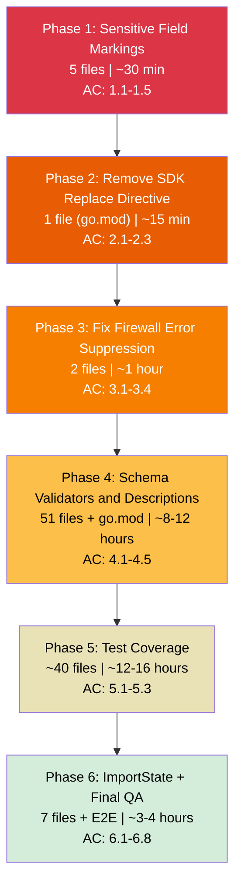

# Work Plan: Production Readiness Hardening

Created Date: 2026-01-31
Type: refactor
Estimated Duration: 5-7 days
Estimated Impact: 85+ files
Related Issue/PR: N/A

## Related Documents

- PRD: [docs/prd/production-readiness-prd.md](/Users/zozo/projects/terraform-provider-vpsie/docs/prd/production-readiness-prd.md)
- ADR: [docs/adr/ADR-0001-production-readiness-hardening.md](/Users/zozo/projects/terraform-provider-vpsie/docs/adr/ADR-0001-production-readiness-hardening.md)
- Design Doc: [docs/design/production-readiness-design.md](/Users/zozo/projects/terraform-provider-vpsie/docs/design/production-readiness-design.md)
- Integration Test Skeleton: [tests/integration_test.go](/Users/zozo/projects/terraform-provider-vpsie/tests/integration_test.go)
- E2E Test Skeleton: [tests/e2e_test.go](/Users/zozo/projects/terraform-provider-vpsie/tests/e2e_test.go)

## Objective

Harden the VPSie Terraform provider to meet HashiCorp production quality standards by addressing six categories of gaps: credential exposure, local build dependencies, silenced errors, missing schema documentation and validation, insufficient test coverage, and incomplete import support. All changes must be backward-compatible and executed in strict priority order.

## Background

The VPSie Terraform provider (27 resources, 24 data sources, 20 service modules) has been audited against HashiCorp production quality standards. The audit found: 5 sensitive fields exposed in plaintext, a local filesystem `replace` directive in `go.mod`, 12 silently discarded errors in firewall code, zero attribute descriptions or validators, test coverage in only 6 of 20 services, and 7 resources missing `ImportState`. These gaps block Terraform Registry publication and enterprise adoption.

## Phase Structure Diagram



## Task Dependency Diagram

```mermaid
graph LR
    subgraph Phase1["Phase 1: Sensitive Fields"]
        T1A["Add Sensitive to provider.go"]
        T1B["Add Sensitive to sshkey files"]
        T1C["Add Sensitive to server files"]
        T1D["Integration test: SensitiveFieldMasking"]
        T1E["Build verification"]
    end

    subgraph Phase2["Phase 2: SDK Replace"]
        T2A["Remove replace from go.mod"]
        T2B["go mod tidy + verify"]
    end

    subgraph Phase3["Phase 3: Firewall Errors"]
        T3A["Fix firewall_resource.go (8 calls)"]
        T3B["Fix firewall_data_source.go (4 calls)"]
        T3C["Integration test: FirewallErrorPropagation"]
        T3D["Build verification"]
    end

    subgraph Phase4["Phase 4: Descriptions + Validators"]
        T4A["Add validators dependency"]
        T4B["Descriptions + validators: resources"]
        T4C["Descriptions: data sources"]
        T4D["go generate ./..."]
    end

    subgraph Phase5["Phase 5: Test Coverage"]
        T5A["Interface wrappers (20 services)"]
        T5B["Unit tests (14 services)"]
        T5C["CheckDestroy (6 test files)"]
        T5D["go test ./... verification"]
    end

    subgraph Phase6["Phase 6: ImportState + QA"]
        T6A["Standard ImportState (3 resources)"]
        T6B["Composite ImportState (4 resources)"]
        T6C["Integration test: ImportStateCompositeID"]
        T6D["E2E test execution"]
        T6E["Final quality gate"]
    end

    T1A --> T1B --> T1C --> T1D --> T1E
    T1E --> T2A --> T2B
    T2B --> T3A --> T3B --> T3C --> T3D
    T3D --> T4A --> T4B --> T4C --> T4D
    T4D --> T5A --> T5B --> T5C --> T5D
    T5D --> T6A --> T6B --> T6C --> T6D --> T6E

    style Phase1 fill:#ffcccc
    style Phase2 fill:#ffe0cc
    style Phase3 fill:#fff0cc
    style Phase4 fill:#ffffcc
    style Phase5 fill:#f0ffcc
    style Phase6 fill:#ccffcc
```



## Risks and Countermeasures

### Technical Risks

- **Risk**: Published SDK differs from local copy, causing runtime failures after replace removal
  - **Impact**: High -- provider may break on API calls
  - **Probability**: Low (confirmed functionally equivalent)
  - **Countermeasure**: Run full acceptance test suite after Phase 2; if failures, re-add replace temporarily and file SDK issue
  - **Detection**: `go build -v .` + `go mod verify` + acceptance tests

- **Risk**: Validators reject previously accepted user configurations (breaking change)
  - **Impact**: Medium -- blocks user upgrades
  - **Probability**: Medium
  - **Countermeasure**: Use only permissive validators (`LengthAtLeast(1)` over restrictive regex); document in changelog; test with known valid configurations
  - **Detection**: Acceptance tests with existing configs; review of each `OneOf` validator against API docs

- **Risk**: `govpsie.Client` is a concrete struct; interface extraction may not work cleanly
  - **Impact**: Medium -- Phase 5 scope expansion
  - **Probability**: Low (interfaces are defined in provider code, not SDK)
  - **Countermeasure**: Interfaces wrap sub-service fields (e.g., `client.Storage`), not the full client; fall back to acceptance-only testing if needed
  - **Detection**: Compile-time verification (`go build -v .`)

- **Risk**: CheckDestroy tests fail intermittently due to API timing
  - **Impact**: Low -- flaky tests
  - **Probability**: Medium
  - **Countermeasure**: Add retry/wait logic in destroy check functions
  - **Detection**: CI test runs

### Schedule Risks

- **Risk**: Phase 4 (51 files) takes longer than estimated due to description research
  - **Impact**: 1-2 day delay
  - **Countermeasure**: Use systematic approach -- start with common patterns (identifier, name, description) then handle service-specific attributes; keep descriptions concise
  - **Detection**: Track files completed vs. remaining

- **Risk**: Latent bugs in 14 untested services discovered during Phase 5
  - **Impact**: Scope expansion -- bugs must be fixed alongside test writing
  - **Countermeasure**: Document bugs found; fix only blocking bugs; defer non-blocking issues
  - **Detection**: Test failures during `go test ./...`

---

## Implementation Phases

**Execution order is STRICT -- each phase must complete before the next begins.**

---

### Phase 1: Sensitive Field Markings (Estimated commits: 1)

**Purpose**: Eliminate credential exposure in `terraform plan` output and CI logs for all 5 identified sensitive fields.

**AC Support**: AC-1.1, AC-1.2, AC-1.3, AC-1.4, AC-1.5 (5 items)
**Test case resolution**: 1/4 integration tests

#### Tasks

- [x] 1.1: Confirm skill constraints -- verify Design Doc Sensitive field implementation pattern, confirm all 5 target files and line locations
- [x] 1.2: Add `Sensitive: true` to `access_token` in `internal/provider/provider.go` (line 69-72)
  - Completion: `Sensitive: true` present in provider schema; `go build -v .` succeeds
- [x] 1.3: Add `Sensitive: true` to `private_key` in `internal/services/sshkey/sshkey_resource.go` (line 73-78)
  - Completion: `Sensitive: true` present in sshkey resource schema
- [x] 1.4: Add `Sensitive: true` to `private_key` in `internal/services/sshkey/sshkey_data_source.go` (line 66-67)
  - Completion: `Sensitive: true` present in sshkey data source schema
- [x] 1.5: Add `Sensitive: true` to `initial_password` in `internal/services/server/server_data_source.go` (line 174-176)
  - Completion: `Sensitive: true` present in server data source schema
- [x] 1.6: Add `Sensitive: true` to `initial_password` in `internal/services/server/server_resource.go` (line 312-317)
  - Completion: `Sensitive: true` present in server resource schema
- [x] 1.7: Implement `TestAccSensitiveFieldMasking` from integration test skeleton (`tests/integration_test.go`)
  - Complete the TODO items: sshkey config with private_key, verify sensitive masking
  - AC support: AC-1.2, AC-1.5
  - // @category: core-functionality | @complexity: medium | @dependency: provider, sshkey resource, server resource
- [x] 1.8: Build verification and grep validation
- [x] 1.9: Verify skill fidelity -- confirm all 5 fields match Design Doc specification exactly

#### Phase Completion Criteria

- [x] All 5 fields have `Sensitive: true` in their schema definitions
- [x] `go build -v .` succeeds
- [x] `grep -rn "Sensitive:" internal/provider/provider.go internal/services/sshkey/ internal/services/server/` shows 5 new Sensitive markings
- [x] `TestAccSensitiveFieldMasking` integration test implemented and compiles
- [x] Zero instances of listed sensitive fields without `Sensitive: true` in target files
- [x] Independently committable as a single commit

#### Operational Verification Procedures

1. Run grep verification:
   ```bash
   grep -rn "Sensitive:" internal/provider/provider.go internal/services/sshkey/ internal/services/server/
   ```
   Expected: 5 new `Sensitive: true` lines (plus 6 pre-existing in other files)

2. Run build verification:
   ```bash
   cd /Users/zozo/projects/terraform-provider-vpsie
   go build -v .
   ```
   Expected: Build succeeds with zero errors

3. Verify no target fields are missing Sensitive marking:
   ```bash
   # Each of these files should contain Sensitive: true for the target attribute
   grep -A2 "access_token" internal/provider/provider.go | grep Sensitive
   grep -A2 "private_key" internal/services/sshkey/sshkey_resource.go | grep Sensitive
   grep -A2 "private_key" internal/services/sshkey/sshkey_data_source.go | grep Sensitive
   grep -A2 "initial_password" internal/services/server/server_data_source.go | grep Sensitive
   grep -A2 "initial_password" internal/services/server/server_resource.go | grep Sensitive
   ```
   Expected: All 5 commands return lines containing `Sensitive`

---

### Phase 2: Remove SDK Replace Directive (Estimated commits: 1)

**Purpose**: Make the provider buildable from a clean `git clone` by removing the local filesystem `replace` directive from `go.mod`.

**AC Support**: AC-2.1, AC-2.2, AC-2.3 (3 items)
**Test case resolution**: 0 new tests (build verification only)

#### Tasks

- [ ] 2.1: Confirm skill constraints -- verify `go.mod` line 16 contains the replace directive, confirm published SDK version matches
- [ ] 2.2: Remove `replace github.com/vpsie/govpsie => /Users/zozo/projects/govpsie` from `go.mod` (line 16)
  - Completion: `go.mod` contains zero `replace` directives
- [ ] 2.3: Run `go mod tidy` to reconcile `go.sum` with published SDK checksums
  - Completion: `go.sum` updated; no errors from `go mod tidy`
- [ ] 2.4: Build and module verification
- [ ] 2.5: Verify skill fidelity -- confirm `go.mod` has no replace directives and build uses published module

#### Phase Completion Criteria

- [ ] `go.mod` contains zero `replace` directives
- [ ] `go mod tidy` completes without errors
- [ ] `go build -v .` succeeds (fetches from module proxy)
- [ ] `go mod verify` reports "all modules verified"
- [ ] Independently committable as a single commit

#### Operational Verification Procedures

1. Verify replace directive removed:
   ```bash
   grep -n "replace" /Users/zozo/projects/terraform-provider-vpsie/go.mod
   ```
   Expected: Zero results

2. Run module tidy and verify:
   ```bash
   cd /Users/zozo/projects/terraform-provider-vpsie
   go mod tidy
   go mod verify
   ```
   Expected: No errors; "all modules verified" output

3. Run clean build:
   ```bash
   go build -v .
   ```
   Expected: Build succeeds; SDK fetched from Go module proxy

---

### Phase 3: Fix Firewall Error Suppression (Estimated commits: 1)

**Purpose**: Replace all silently discarded `ListValueFrom` errors in firewall code with proper diagnostic propagation to prevent silent data corruption.

**AC Support**: AC-3.1, AC-3.2, AC-3.3, AC-3.4 (4 items)
**Test case resolution**: 2/4 integration tests (cumulative)

#### Tasks

- [x] 3.1: Confirm skill constraints -- verify all 12 `ListValueFrom` call locations in firewall code match Design Doc line references
- [x] 3.2: Fix `firewall_resource.go` Create method -- replace `_, _ :=` with diagnostic capture at lines 394-395 (InBound) and 421-422 (OutBound)
  - Pattern: `destList, destDiags := types.ListValueFrom(...); resp.Diagnostics.Append(destDiags...); sourceList, sourceDiags := types.ListValueFrom(...); resp.Diagnostics.Append(sourceDiags...); if resp.Diagnostics.HasError() { return }`
  - Completion: 4 ListValueFrom calls in Create properly propagate errors
- [x] 3.3: Fix `firewall_resource.go` Read method -- same pattern at lines 508-509 (InBound) and 535-536 (OutBound)
  - Completion: 4 ListValueFrom calls in Read properly propagate errors
- [x] 3.4: Fix `firewall_data_source.go` Read method -- same pattern at lines 332-333 (InBound) and 359-360 (OutBound)
  - Completion: 4 ListValueFrom calls in data source Read properly propagate errors
- [x] 3.5: Implement `TestAccFirewallErrorPropagation` from integration test skeleton (`tests/integration_test.go`)
  - Complete the TODO items: firewall config with rules, verify CRUD succeeds without silent failures
  - AC support: AC-3.1, AC-3.2, AC-3.3
  - // @category: core-functionality | @complexity: high | @dependency: firewall resource, firewall data source
- [x] 3.6: Build verification and static analysis
- [x] 3.7: Verify skill fidelity -- confirm zero `_, _ :=` patterns remain in firewall code

#### Phase Completion Criteria

- [x] All 12 `ListValueFrom` calls across 6 pairs have diagnostic capture and propagation
- [x] `go build -v .` succeeds
- [x] `grep -rn '_, _ :=' internal/services/firewall/` returns zero results
- [x] `grep -rn '_, _\s*=' internal/services/firewall/` returns zero results
- [x] `TestAccFirewallErrorPropagation` integration test implemented and compiles
- [x] Each error pair includes `if resp.Diagnostics.HasError() { return }` guard
- [ ] Independently committable as a single commit

#### Operational Verification Procedures

1. Verify no discarded errors remain:
   ```bash
   grep -rn '_, _ :=' internal/services/firewall/
   grep -rn '_, _\s*=' internal/services/firewall/
   ```
   Expected: Zero results for both commands

2. Verify error propagation pattern is correct:
   ```bash
   grep -c "resp.Diagnostics.Append" internal/services/firewall/firewall_resource.go
   grep -c "resp.Diagnostics.Append" internal/services/firewall/firewall_data_source.go
   ```
   Expected: Resource file shows increase of 8 Append calls; data source shows increase of 4

3. Build verification:
   ```bash
   go build -v .
   ```
   Expected: Build succeeds with zero errors

---

### Phase 4: Schema Validators and Descriptions (Estimated commits: 3-5)

**Purpose**: Add `MarkdownDescription` to every attribute in all 51 resource/data source files and add validators to Required and meaningful Optional attributes. This is the largest phase by file count.

**AC Support**: AC-4.1, AC-4.2, AC-4.3, AC-4.4, AC-4.5 (5 items)
**Test case resolution**: 2/4 integration tests (no new integration tests in this phase)

#### Task Group A: Dependency Setup

- [x] 4.1: Confirm skill constraints -- verify validator library compatibility with terraform-plugin-framework v1.17.0; confirm all 51 files need descriptions
- [x] 4.2: Add `terraform-plugin-framework-validators` dependency to `go.mod`
  ```bash
  go get github.com/hashicorp/terraform-plugin-framework-validators@v0.17.0
  go mod tidy
  ```
  - Completion: Dependency in `go.mod`; `go build -v .` succeeds

#### Task Group B: Resources -- MarkdownDescription + Validators (27 files)

Descriptions must explain each attribute's purpose in 1-2 sentences. Validators apply to Required string (`LengthAtLeast(1)`) and meaningful enum/numeric fields.

- [ ] 4.3: `internal/services/accesstoken/accesstoken_resource.go` -- add descriptions + validators
- [ ] 4.4: `internal/services/backup/backup_resource.go` -- add descriptions + validators
- [ ] 4.5: `internal/services/backup/backup_policy_resource.go` -- add descriptions + validators
- [ ] 4.6: `internal/services/bucket/bucket_resource.go` -- add descriptions + validators
- [ ] 4.7: `internal/services/domain/domain_resource.go` -- add descriptions + validators
- [ ] 4.8: `internal/services/domain/dns_record_resource.go` -- add descriptions + validators (including `OneOf` for record type: A, AAAA, CNAME, MX, TXT, NS, SRV)
- [ ] 4.9: `internal/services/domain/reverse_dns_resource.go` -- add descriptions + validators
- [ ] 4.10: `internal/services/fip/fip_resource.go` -- add descriptions + validators (including `OneOf` for ip_type: ipv4, ipv6)
- [x] 4.11: `internal/services/firewall/firewall_resource.go` -- add descriptions + validators
- [x] 4.12: `internal/services/firewall/firewall_attachment_resource.go` -- add descriptions + validators
- [ ] 4.13: `internal/services/gateway/gateway_resource.go` -- add descriptions + validators
- [ ] 4.14: `internal/services/image/image_resource.go` -- add descriptions + validators
- [x] 4.15: `internal/services/kubernetes/kubernetes_resource.go` -- add descriptions + validators
- [x] 4.16: `internal/services/kubernetes/kubernetes_group_resource.go` -- add descriptions + validators
- [x] 4.17: `internal/services/loadbalancer/loadbalancer_resource.go` -- add descriptions + validators
- [ ] 4.18: `internal/services/monitoring/monitoring_rule_resource.go` -- add descriptions + validators (including `OneOf` for condition)
- [ ] 4.19: `internal/services/project/project_resource.go` -- add descriptions + validators
- [ ] 4.20: `internal/services/script/script_resource.go` -- add descriptions + validators
- [ ] 4.21: `internal/services/server/server_resource.go` -- add descriptions + validators
- [ ] 4.22: `internal/services/snapshot/server_snapshot_resource.go` -- add descriptions + validators
- [ ] 4.23: `internal/services/snapshot/snapshot_policy_resource.go` -- add descriptions + validators
- [ ] 4.24: `internal/services/sshkey/sshkey_resource.go` -- add descriptions + validators
- [ ] 4.25: `internal/services/storage/storage_resource.go` -- add descriptions + validators (including `OneOf` for disk_format: EXT4, XFS)
- [ ] 4.26: `internal/services/storage/storage_attachment_resource.go` -- add descriptions + validators
- [ ] 4.27: `internal/services/storage/storage_snapshot_resource.go` -- add descriptions + validators
- [ ] 4.28: `internal/services/vpc/vpc_resource.go` -- add descriptions + validators
- [ ] 4.29: `internal/services/vpc/vpc_server_assignment_resource.go` -- add descriptions + validators

#### Task Group C: Data Sources -- MarkdownDescription Only (24 files)

Data source attributes are typically all Computed and do not need validators.

- [ ] 4.30: `internal/services/accesstoken/accesstoken_datasource.go` -- add descriptions
- [ ] 4.31: `internal/services/backup/backup_data_source.go` -- add descriptions
- [ ] 4.32: `internal/services/backup/backup_policy_datasource.go` -- add descriptions
- [ ] 4.33: `internal/services/bucket/bucket_datasource.go` -- add descriptions
- [ ] 4.34: `internal/services/datacenter/datacenter_datasource.go` -- add descriptions
- [ ] 4.35: `internal/services/domain/domain_data_source.go` -- add descriptions
- [ ] 4.36: `internal/services/fip/fip_datasource.go` -- add descriptions
- [x] 4.37: `internal/services/firewall/firewall_data_source.go` -- add descriptions
- [ ] 4.38: `internal/services/gateway/gateway_data_source.go` -- add descriptions
- [ ] 4.39: `internal/services/image/image_data_source.go` -- add descriptions
- [ ] 4.40: `internal/services/ip/ip_datasource.go` -- add descriptions
- [x] 4.41: `internal/services/kubernetes/kubernetes_data_source.go` -- add descriptions
- [x] 4.42: `internal/services/kubernetes/kubernetes_group_data_source.go` -- add descriptions
- [x] 4.43: `internal/services/loadbalancer/loadbalancer_data_source.go` -- add descriptions
- [ ] 4.44: `internal/services/monitoring/monitoring_rule_datasource.go` -- add descriptions
- [ ] 4.45: `internal/services/project/project_data_source.go` -- add descriptions
- [ ] 4.46: `internal/services/script/script_data_source.go` -- add descriptions
- [ ] 4.47: `internal/services/server/server_data_source.go` -- add descriptions
- [ ] 4.48: `internal/services/snapshot/server_snapshot_data_source.go` -- add descriptions
- [ ] 4.49: `internal/services/snapshot/snapshot_policy_datasource.go` -- add descriptions
- [ ] 4.50: `internal/services/sshkey/sshkey_data_source.go` -- add descriptions
- [ ] 4.51: `internal/services/storage/storage_data_source.go` -- add descriptions
- [ ] 4.52: `internal/services/storage/storage_snapshot_data_resource.go` -- add descriptions (confirmed data source despite filename)
- [ ] 4.53: `internal/services/vpc/vpc_data_source.go` -- add descriptions

#### Task Group D: Provider Description + Doc Regeneration

- [x] 4.54: Add `MarkdownDescription` to provider-level schema in `internal/provider/provider.go` (FR-S2)
- [ ] 4.55: Regenerate documentation:
  ```bash
  go generate ./...
  ```
  - Completion: `docs/` directory reflects all attribute descriptions
- [ ] 4.56: Build verification: `go build -v .`
- [ ] 4.57: Verify skill fidelity -- spot-check 5 resource files and 5 data source files for description completeness

#### Phase Completion Criteria

- [ ] `terraform-plugin-framework-validators` in `go.mod`
- [ ] All 27 resource files have `MarkdownDescription` on every attribute
- [ ] All 24 data source files have `MarkdownDescription` on every attribute
- [ ] All Required string attributes have `stringvalidator.LengthAtLeast(1)`
- [ ] Known enum fields have `stringvalidator.OneOf(...)` validators
- [ ] Positive-only numeric fields have `int64validator.AtLeast(1)` or `AtLeast(0)`
- [ ] `go build -v .` succeeds
- [ ] `go generate ./...` succeeds and `docs/` is updated
- [ ] Provider-level schema has `MarkdownDescription`
- [ ] Each task group independently committable

#### Operational Verification Procedures

1. Verify validator dependency:
   ```bash
   grep "terraform-plugin-framework-validators" /Users/zozo/projects/terraform-provider-vpsie/go.mod
   ```
   Expected: Version entry present

2. Spot-check descriptions (sample 3 files):
   ```bash
   grep -c "MarkdownDescription" internal/services/storage/storage_resource.go
   grep -c "MarkdownDescription" internal/services/sshkey/sshkey_resource.go
   grep -c "MarkdownDescription" internal/services/server/server_data_source.go
   ```
   Expected: Each file returns a count matching its number of attributes

3. Spot-check validators:
   ```bash
   grep -c "Validators:" internal/services/storage/storage_resource.go
   grep -c "LengthAtLeast" internal/services/sshkey/sshkey_resource.go
   ```
   Expected: Non-zero counts for Required attributes

4. Build and generate:
   ```bash
   go build -v .
   go generate ./...
   ```
   Expected: Both succeed

---

### Phase 5: Test Coverage (Estimated commits: 3-5)

**Purpose**: Create service-specific interface wrappers, add unit tests for all 14 untested services, and add `CheckDestroy` to all 6 existing acceptance test files.

**AC Support**: AC-5.1, AC-5.2, AC-5.3 (3 items)
**Test case resolution**: 2/4 integration tests (no new integration tests in this phase)

#### Task Group A: Interface Wrappers (20 services)

Create `<service>_api.go` files with narrow interfaces wrapping `govpsie.Client` sub-service fields. Each interface declares only the methods used by that service's resource and data source. Resource struct fields change from `*govpsie.Client` to sub-service interface type. Configure method extracts sub-service from full client.

- [ ] 5.1: Confirm skill constraints -- verify sub-service interface pattern from Design Doc; read each resource/data source to catalog SDK method calls
- [ ] 5.2: Create `internal/services/backup/backup_api.go` (BackupAPI wrapping `client.Backup`)
  - Update resource struct field type and Configure method
- [ ] 5.3: Create `internal/services/bucket/bucket_api.go` (BucketAPI wrapping `client.Bucket`)
  - Update resource struct field type and Configure method
- [ ] 5.4: Create `internal/services/datacenter/datacenter_api.go` (DatacenterAPI wrapping `client.DataCenter`)
  - Update data source struct field type and Configure method
- [ ] 5.5: Create `internal/services/fip/fip_api.go` (FipAPI wrapping `client.FIP`)
  - Update resource struct field type and Configure method
- [ ] 5.6: Create `internal/services/firewall/firewall_api.go` (FirewallAPI wrapping `client.Firewall`)
  - Update resource and data source struct field types and Configure methods
- [ ] 5.7: Create `internal/services/gateway/gateway_api.go` (GatewayAPI wrapping `client.Gateway`)
  - Update resource struct field type and Configure method
- [ ] 5.8: Create `internal/services/image/image_api.go` (ImageAPI wrapping `client.Image`)
  - Update resource struct field type and Configure method
- [ ] 5.9: Create `internal/services/ip/ip_api.go` (IpAPI wrapping `client.IP`)
  - Update data source struct field type and Configure method
- [ ] 5.10: Create `internal/services/kubernetes/kubernetes_api.go` (KubernetesAPI wrapping `client.Kubernetes`)
  - Update resource and data source struct field types and Configure methods
- [ ] 5.11: Create `internal/services/loadbalancer/loadbalancer_api.go` (LoadbalancerAPI wrapping `client.LB`)
  - Update resource struct field type and Configure method
- [ ] 5.12: Create `internal/services/monitoring/monitoring_api.go` (MonitoringAPI wrapping `client.Monitoring`)
  - Update resource struct field type and Configure method
- [ ] 5.13: Create `internal/services/server/server_api.go` (ServerAPI wrapping `client.Server`)
  - Update resource struct field type and Configure method
- [ ] 5.14: Create `internal/services/snapshot/snapshot_api.go` (SnapshotAPI wrapping `client.Snapshot`)
  - Update resource struct field type and Configure method
- [ ] 5.15: Create `internal/services/vpc/vpc_api.go` (VpcAPI wrapping `client.VPC`)
  - Update resource struct field type and Configure method
- [ ] 5.16: Create interfaces for already-tested services: `accesstoken`, `domain`, `project`, `script`, `sshkey`, `storage`
  - Update struct field types and Configure methods (existing tests are acceptance tests, not affected by interface change)
- [ ] 5.17: Build verification: `go build -v .` after all interface changes
  - Critical check: Confirms all sub-service concrete types satisfy the defined interfaces

#### Task Group B: Unit Tests (14 untested services)

Create unit tests with mock implementations of the sub-service interfaces. Use table-driven tests. Each test verifies resource CRUD business logic through the interface.

- [ ] 5.18: Create `internal/services/backup/backup_resource_test.go` -- mock BackupAPI, test Create/Read/Delete
- [ ] 5.19: Create `internal/services/bucket/bucket_resource_test.go` -- mock BucketAPI, test Create/Read/Delete
- [ ] 5.20: Create `internal/services/fip/fip_resource_test.go` -- mock FipAPI, test Create/Read/Delete
- [ ] 5.21: Create `internal/services/firewall/firewall_resource_test.go` -- mock FirewallAPI, test Create/Read/Delete
  - Include test for error propagation from ListValueFrom (AC-3.1 unit-level verification)
- [ ] 5.22: Create `internal/services/gateway/gateway_resource_test.go` -- mock GatewayAPI, test Create/Read/Delete
- [ ] 5.23: Create `internal/services/image/image_resource_test.go` -- mock ImageAPI, test Create/Read/Delete
- [ ] 5.24: Create `internal/services/kubernetes/kubernetes_resource_test.go` -- mock KubernetesAPI, test Create/Read/Delete
- [ ] 5.25: Create `internal/services/loadbalancer/loadbalancer_resource_test.go` -- mock LoadbalancerAPI, test Create/Read/Delete
- [ ] 5.26: Create `internal/services/monitoring/monitoring_rule_resource_test.go` -- mock MonitoringAPI, test Create/Read/Delete
- [ ] 5.27: Create `internal/services/server/server_resource_test.go` -- mock ServerAPI, test Create/Read/Delete
- [ ] 5.28: Create `internal/services/snapshot/server_snapshot_resource_test.go` -- mock SnapshotAPI, test Create/Read/Delete
- [ ] 5.29: Create `internal/services/vpc/vpc_resource_test.go` -- mock VpcAPI, test Create/Read/Delete
- [ ] 5.30: Create `internal/services/datacenter/datacenter_datasource_test.go` -- mock DatacenterAPI (data source only)
- [ ] 5.31: Create `internal/services/ip/ip_datasource_test.go` -- mock IpAPI (data source only)

#### Task Group C: CheckDestroy for Existing Tests (6 files)

Add `CheckDestroy` functions that construct `govpsie.Client` directly from `VPSIE_ACCESS_TOKEN` env var (acctest package does not expose a provider instance).

- [ ] 5.32: Add `testAccCheckStorageResourceDestroy` to `internal/services/storage/storage_resource_test.go`
- [ ] 5.33: Add `testAccCheckSshkeyResourceDestroy` to `internal/services/sshkey/sshkey_resource_test.go`
- [ ] 5.34: Add `testAccCheckScriptResourceDestroy` to `internal/services/script/script_resource_test.go`
- [ ] 5.35: Add `testAccCheckProjectResourceDestroy` to `internal/services/project/project_resource_test.go`
- [ ] 5.36: Add `testAccCheckDomainResourceDestroy` to `internal/services/domain/domain_resource_test.go`
- [ ] 5.37: Add `testAccCheckAccessTokenResourceDestroy` to `internal/services/accesstoken/accesstoken_resource_test.go`

#### Task Group D: Verification

- [ ] 5.38: Run full unit test suite:
  ```bash
  go test ./... -count=1
  ```
  - Completion: All 20 service modules have passing unit tests (without TF_ACC)
- [ ] 5.39: Verify skill fidelity -- confirm all interfaces are narrow (only methods actually used by resource/data source), all unit tests pass independently

#### Phase Completion Criteria

- [ ] 20 `_api.go` interface files created (one per service package)
- [ ] All 20 resource/data source struct types use sub-service interface fields
- [ ] 14 new unit test files created for previously untested services
- [ ] 6 existing acceptance test files have `CheckDestroy` functions
- [ ] `go build -v .` succeeds
- [ ] `go test ./... -count=1` passes (unit tests, no TF_ACC)
- [ ] Each interface declares only methods used by the service
- [ ] Each task group independently committable

#### Operational Verification Procedures

1. Verify interface files exist:
   ```bash
   find internal/services -name "*_api.go" | wc -l
   ```
   Expected: 20 (or grouped by service package, at least 14-20 files)

2. Verify no compilation errors with interfaces:
   ```bash
   go build -v .
   ```
   Expected: Build succeeds (proves sub-service types satisfy interfaces)

3. Run unit tests only (no acceptance):
   ```bash
   go test ./... -count=1
   ```
   Expected: All tests pass; output shows test runs in all 20 service packages

4. Verify CheckDestroy is present in existing tests:
   ```bash
   grep -rn "CheckDestroy" internal/services/storage/storage_resource_test.go
   grep -rn "CheckDestroy" internal/services/sshkey/sshkey_resource_test.go
   grep -rn "CheckDestroy" internal/services/script/script_resource_test.go
   grep -rn "CheckDestroy" internal/services/project/project_resource_test.go
   grep -rn "CheckDestroy" internal/services/domain/domain_resource_test.go
   grep -rn "CheckDestroy" internal/services/accesstoken/accesstoken_resource_test.go
   ```
   Expected: Each file returns at least one match

---

### Phase 6: ImportState Implementations + Final Quality Assurance (Estimated commits: 2)

**Purpose**: Add `ImportState` to the 7 remaining resources, implement and run the composite ID integration test, run the E2E test skeleton, and perform final quality gate verification across all acceptance criteria.

**AC Support**: AC-6.1 through AC-6.8 (8 items) + full AC coverage verification
**Test case resolution**: 4/4 integration tests + 1/1 E2E test (all resolved)

#### Task Group A: Standard ImportState (3 resources)

Use `resource.ImportStatePassthroughID` with the appropriate attribute path.

- [ ] 6.1: Confirm skill constraints -- verify import ID fields and struct names match Design Doc for all 7 resources
- [ ] 6.2: Add `ImportState` to `internal/services/accesstoken/accesstoken_resource.go`
  - Add `resource.ResourceWithImportState` interface assertion
  - Import: `path.Root("identifier")`
  - AC support: AC-6.1
- [ ] 6.3: Add `ImportState` to `internal/services/fip/fip_resource.go`
  - Add `resource.ResourceWithImportState` interface assertion
  - Import: `path.Root("id")`
  - AC support: AC-6.3
- [ ] 6.4: Add `ImportState` to `internal/services/monitoring/monitoring_rule_resource.go`
  - Add `resource.ResourceWithImportState` interface assertion
  - Import: `path.Root("identifier")`
  - AC support: AC-6.5

#### Task Group B: Composite ID ImportState (4 resources)

Implement custom `ImportState` methods with `/` separator parsing, format validation, and clear error diagnostics.

- [ ] 6.5: Add `ImportState` to `internal/services/firewall/firewall_attachment_resource.go`
  - Composite format: `<group_id>/<vm_identifier>` (2-part)
  - AC support: AC-6.2, AC-6.8
- [ ] 6.6: Add `ImportState` to `internal/services/vpc/vpc_server_assignment_resource.go`
  - Composite format: `<vm_identifier>/<vpc_id>` (2-part, vpc_id requires int64 parse)
  - AC support: AC-6.4, AC-6.8
- [ ] 6.7: Add `ImportState` to `internal/services/domain/reverse_dns_resource.go`
  - Composite format: `<vm_identifier>/<ip>` (2-part)
  - AC support: AC-6.6, AC-6.8
- [ ] 6.8: Add `ImportState` to `internal/services/domain/dns_record_resource.go`
  - Composite format: `<domain_identifier>/<type>/<name>` (3-part)
  - AC support: AC-6.7, AC-6.8

#### Task Group C: Integration + E2E Tests

- [ ] 6.9: Implement `TestAccImportStateCompositeID` from integration test skeleton (`tests/integration_test.go`)
  - Complete the TODO items: DNS record creation, 3-part composite ID import, state verification
  - AC support: AC-6.2, AC-6.4, AC-6.7
  - // @category: integration | @complexity: high | @dependency: firewall_attachment, vpc_server_assignment, dns_record resources
- [ ] 6.10: Implement `TestAccImportStateCompositeID_InvalidFormat` from integration test skeleton
  - Complete the TODO items: malformed ID import, ExpectError with format hint
  - AC support: AC-6.8
- [ ] 6.11: Execute E2E test skeleton (`tests/e2e_test.go`) -- `TestE2EProductionReadinessFullCycle`
  - Complete the TODO items in config helpers and test steps
  - Covers: AC-1.2, AC-2.1, AC-3.1, AC-4.3, AC-4.4, AC-6.1, AC-6.8
  - // @category: e2e | @complexity: high | @dependency: full-system

#### Task Group D: Final Quality Gate

- [ ] 6.12: Verify all Design Doc acceptance criteria achieved:
  - [ ] AC-1.x: 5/5 sensitive fields marked (grep verification)
  - [ ] AC-2.x: Zero replace directives; build and module verify pass
  - [ ] AC-3.x: Zero `_, _ :=` in firewall code; error propagation confirmed
  - [ ] AC-4.x: 100% description coverage; validators on all Required attributes
  - [ ] AC-5.x: 20/20 services with unit tests; 6/6 acceptance tests with CheckDestroy
  - [ ] AC-6.x: 27/27 resources support ImportState
- [ ] 6.13: Quality checks:
  ```bash
  go build -v .
  go mod verify
  go test ./... -count=1
  go generate ./...
  ```
  All must pass with zero errors.
- [ ] 6.14: Verify skill fidelity -- final review of all changes against Design Doc specifications; confirm no divergence from ADR decisions

#### Phase Completion Criteria

- [ ] 7 resources have `ImportState` implementations
- [ ] 27/27 resources now support `terraform import`
- [ ] `TestAccImportStateCompositeID` integration test implemented and compiles
- [ ] `TestAccImportStateCompositeID_InvalidFormat` integration test implemented and compiles
- [ ] `TestE2EProductionReadinessFullCycle` E2E test implemented and compiles
- [ ] `go build -v .` succeeds
- [ ] `go test ./... -count=1` passes (all unit tests)
- [ ] All 26 Design Doc acceptance criteria verified
- [ ] Independently committable

#### Operational Verification Procedures

1. Verify ImportState interface assertions compile:
   ```bash
   go build -v .
   ```
   Expected: Build succeeds (compile-time verification that all 7 resources implement ResourceWithImportState)

2. Count ImportState implementations:
   ```bash
   grep -rn "ResourceWithImportState" internal/services/ | wc -l
   ```
   Expected: 27 (20 existing + 7 new)

3. Verify composite ID error messages:
   ```bash
   grep -rn "Expected import identifier with format" internal/services/
   ```
   Expected: 4 results (one per composite ID resource)

4. Run full test suite:
   ```bash
   go test ./... -count=1
   ```
   Expected: All tests pass

5. Full build and module verification:
   ```bash
   go build -v .
   go mod verify
   go generate ./...
   ```
   Expected: All succeed with zero errors

6. Final acceptance criteria checklist (manual verification):
   ```bash
   # AC-1.x: Sensitive fields
   grep -rn "Sensitive:\s*true" internal/provider/ internal/services/sshkey/ internal/services/server/ | wc -l
   # Expected: 5 new + pre-existing = 11+

   # AC-2.x: No replace directives
   grep "replace" go.mod
   # Expected: zero results

   # AC-3.x: No discarded errors
   grep -rn '_, _ :=' internal/services/firewall/
   # Expected: zero results

   # AC-4.x: Descriptions
   grep -rL "MarkdownDescription" internal/services/*/*.go | grep -v _test | grep -v _api
   # Expected: zero results (all files have descriptions)

   # AC-5.x: Test files
   find internal/services -name "*_test.go" | wc -l
   # Expected: 20+ test files

   # AC-6.x: ImportState
   grep -rn "ResourceWithImportState" internal/services/ | wc -l
   # Expected: 27
   ```

---

## Summary: Test Integration Plan

### Integration Tests (from `tests/integration_test.go`)

| Test Function | Phase | AC Coverage | Category | Complexity |
|---|---|---|---|---|
| `TestAccSensitiveFieldMasking` | Phase 1 | AC-1.1, AC-1.2, AC-1.5 | core-functionality | medium |
| `TestAccFirewallErrorPropagation` | Phase 3 | AC-3.1, AC-3.2, AC-3.3 | core-functionality | high |
| `TestAccImportStateCompositeID` | Phase 6 | AC-6.2, AC-6.4, AC-6.7 | integration | high |
| `TestAccImportStateCompositeID_InvalidFormat` | Phase 6 | AC-6.8 | integration | high |

### E2E Tests (from `tests/e2e_test.go`)

| Test Function | Phase | AC Coverage | Category | Complexity |
|---|---|---|---|---|
| `TestE2EProductionReadinessFullCycle` | Phase 6 (final) | AC-1.2, AC-2.1, AC-3.1, AC-4.3, AC-4.4, AC-6.1, AC-6.8 | e2e | high |

### Test Resolution Progress by Phase

| Phase | Cumulative Integration Tests Resolved | Cumulative E2E Tests Resolved | Total |
|---|---|---|---|
| Phase 1 | 1/4 | 0/1 | 1/5 |
| Phase 2 | 1/4 | 0/1 | 1/5 |
| Phase 3 | 2/4 | 0/1 | 2/5 |
| Phase 4 | 2/4 | 0/1 | 2/5 |
| Phase 5 | 2/4 | 0/1 | 2/5 |
| Phase 6 | 4/4 | 1/1 | **5/5 (all resolved)** |

---

## Completion Criteria

- [ ] All 6 phases completed in strict order
- [ ] Each phase's operational verification procedures executed and passed
- [ ] All 26 Design Doc acceptance criteria satisfied
- [ ] All 5 test skeletons (4 integration + 1 E2E) implemented
- [ ] `go build -v .` succeeds
- [ ] `go mod verify` reports all modules verified
- [ ] `go test ./... -count=1` passes (all unit tests)
- [ ] `go generate ./...` succeeds (docs regenerated)
- [ ] Zero `replace` directives in `go.mod`
- [ ] Zero `_, _ :=` patterns in firewall code
- [ ] 27/27 resources support `terraform import`
- [ ] 20/20 service modules have unit tests
- [ ] 6/6 existing acceptance tests have `CheckDestroy`
- [ ] 100% schema attribute description coverage
- [ ] User review approval obtained

## Progress Tracking

### Phase 1: Sensitive Field Markings
- Start: 2026-01-31
- Complete: 2026-01-31
- Notes: All 5 sensitive fields marked, integration test implemented, build verified

### Phase 2: Remove SDK Replace Directive
- Start:
- Complete:
- Notes:

### Phase 3: Fix Firewall Error Suppression
- Start: 2026-01-31
- Complete: 2026-01-31
- Notes: All 12 ListValueFrom calls fixed across 6 pairs (3 locations x 2 files). Integration test implemented. Build verified.

### Phase 4: Schema Validators and Descriptions
- Start:
- Complete:
- Notes:

### Phase 5: Test Coverage
- Start:
- Complete:
- Notes:

### Phase 6: ImportState + Final Quality Assurance
- Start:
- Complete:
- Notes:

## Notes

- **Strict execution order**: Phases 1-6 must be completed sequentially. Each phase must be fully verified before the next begins. This reflects risk severity ordering from the PRD.
- **Independently committable**: Each phase (and often each task group within a phase) should produce a clean, independently committable unit. This enables incremental review and rollback.
- **Validator conservatism**: Use permissive validators (`LengthAtLeast(1)`) over restrictive patterns to avoid breaking existing configurations. Add stricter validators only for well-documented enum fields.
- **Interface pattern**: Interfaces wrap sub-service fields (`client.Storage`, `client.Server`, etc.), NOT the full `*govpsie.Client`. This keeps interfaces narrow and focused per the Interface Segregation Principle.
- **CheckDestroy pattern**: Must construct `govpsie.Client` directly from `VPSIE_ACCESS_TOKEN` env var because the `acctest` package does not expose a provider instance.
- **storage_snapshot_data_resource.go**: Confirmed as a data source despite the misleading filename. No ImportState needed. File rename is tracked separately outside this work plan.
- **E2E test timing**: The E2E test in `tests/e2e_test.go` is executed ONLY in Phase 6 after all implementation is complete. Integration tests are implemented alongside their respective phases.

## Change History

| Date | Changes |
|------|---------|
| 2026-01-31 | Initial work plan created from PRD, ADR-0001, and Design Doc |
