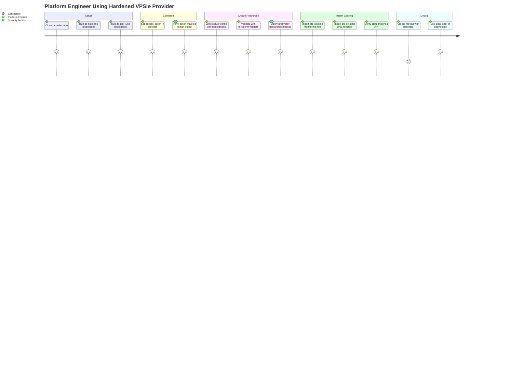
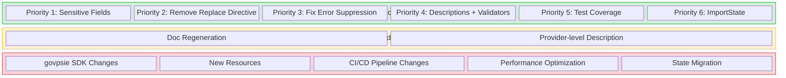
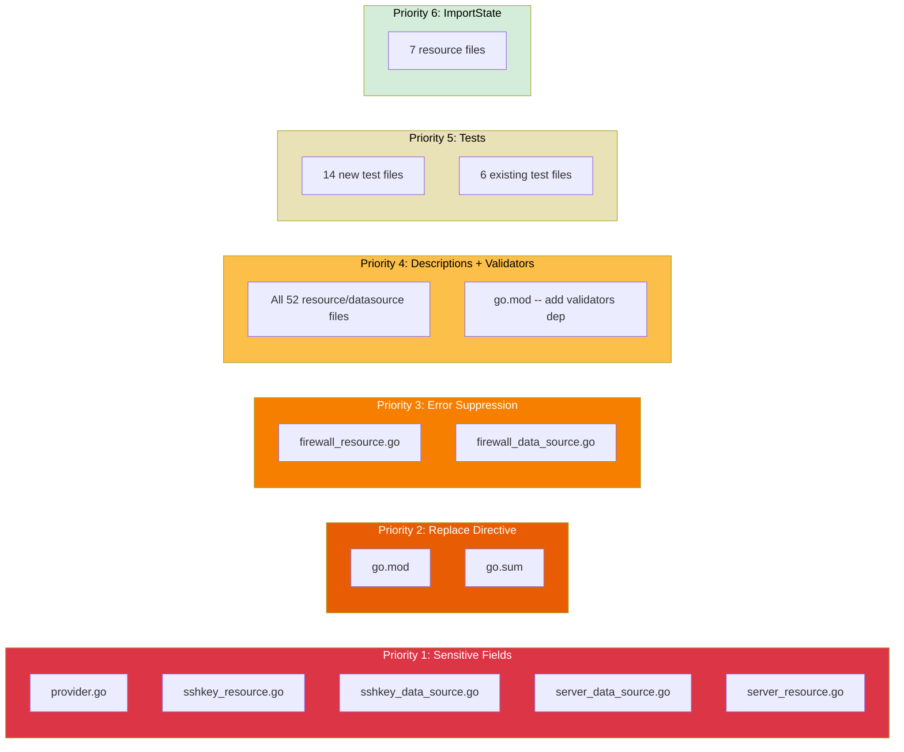

# PRD: VPSie Terraform Provider -- Production Readiness Hardening

**Version**: 1.1
**Date**: 2026-01-31
**Mode**: Reverse-Engineer
**Status**: Proposed

---

## Overview

### One-line Summary

Harden the existing VPSie Terraform provider to meet HashiCorp production quality standards by fixing credential exposure, removing local build dependencies, propagating errors, adding schema documentation and validation, expanding test coverage, and implementing missing import support.

### Background

The VPSie Terraform provider (`terraform-provider-vpsie`) is built on the HashiCorp Terraform Plugin Framework v1 and currently manages 20 service modules comprising 27 resources and 24 data sources for the VPSie cloud platform. A production readiness audit has identified six categories of gaps that prevent the provider from being published to the Terraform Registry or adopted by enterprise teams with confidence.

The most critical finding is that sensitive fields -- including the provider-level API access token, SSH private keys, and server initial passwords -- are not marked with `Sensitive: true` in their schema definitions. This means these values appear in plaintext in `terraform plan` output, state file diffs, and CI/CD logs. The next most critical issue is a `replace` directive in `go.mod` that pins the `govpsie` SDK to a local filesystem path, making the provider unbuildable for anyone other than the original developer.

Beyond these blockers, the audit found silently discarded errors in firewall service code, zero attribute descriptions across all schemas, no input validators, test coverage in only 6 of 20 services, and 8 resources missing `ImportState` implementations.

Addressing these gaps in strict priority order will bring the provider into alignment with HashiCorp's published provider design principles and best practices for production-grade Terraform providers.

## User Stories

### Primary Users

- **Platform engineers** who provision and manage VPSie cloud infrastructure using Terraform
- **DevOps/SRE teams** who maintain Terraform configurations in CI/CD pipelines
- **Security auditors** who review Terraform plan outputs and state for credential exposure
- **Provider contributors** who need a buildable, testable, well-documented codebase

### User Stories

```
As a platform engineer using the VPSie Terraform provider,
I want the provider to follow HashiCorp production quality standards
So that credentials don't leak, builds work for everyone, errors surface properly,
docs exist for all attributes, and resources can be imported.
```

```
As a security auditor reviewing Terraform plan outputs,
I want all credentials and secrets to be masked in plan and log output
So that sensitive values are never exposed in CI/CD logs or shared terminals.
```

```
As a contributor to the VPSie Terraform provider,
I want `go build` to succeed without local filesystem dependencies
So that I can clone the repository and build it immediately.
```

```
As a platform engineer debugging firewall configurations,
I want all errors to be properly surfaced in Terraform diagnostics
So that I can identify and fix configuration issues without silent failures.
```

```
As a platform engineer reading schema documentation,
I want every resource and data source attribute to have a description
So that I understand what each field means without reading source code.
```

```
As a platform engineer managing existing infrastructure,
I want all resources to support `terraform import`
So that I can bring pre-existing cloud resources under Terraform management.
```

### Use Cases

1. **Credential protection in CI**: A team runs `terraform plan` in GitHub Actions. With sensitive markings, the access token and SSH keys display as `(sensitive value)` instead of plaintext in the job log.

2. **Open source contributor onboarding**: A new contributor forks the repository, runs `go build`, and gets a successful binary without needing a specific local directory structure matching the original developer's machine.

3. **Firewall debugging**: An engineer creates a firewall group with inbound rules. If the internal `ListValueFrom` call fails due to malformed data, Terraform surfaces the error instead of silently producing an incorrect state.

4. **Self-service attribute reference**: An engineer writing a `vpsie_server` resource block uses `terraform providers schema -json` or the registry documentation to understand every available attribute, its purpose, and valid values.

5. **Import existing infrastructure**: An engineer with pre-existing VPSie servers, monitoring rules, and DNS records runs `terraform import` to adopt them into their Terraform state without recreating them.

6. **Test-driven confidence**: Before merging a pull request that modifies the storage service, CI runs unit and acceptance tests covering all 20 services, giving confidence that the change does not break other modules.

## Functional Requirements

### Must Have (MVP) -- Strict Priority Order

**Priority 1: Fix Sensitive Field Markings**

- [ ] FR-1.1: Mark provider `access_token` attribute as `Sensitive: true`
  - File: `internal/provider/provider.go`, line 71
  - AC: Given a Terraform plan that includes the provider configuration, when the plan output is displayed, then the `access_token` value is shown as `(sensitive value)`.

- [ ] FR-1.2: Mark SSH `private_key` attribute as `Sensitive: true` in the sshkey resource
  - File: `internal/services/sshkey/sshkey_resource.go`, line 73
  - AC: Given a Terraform plan that creates or changes an `sshkey` resource, when the plan output is displayed, then the `private_key` value is shown as `(sensitive value)`.

- [ ] FR-1.3: Mark SSH `private_key` attribute as `Sensitive: true` in the sshkey data source
  - File: `internal/services/sshkey/sshkey_data_source.go`, line 66
  - AC: Given a Terraform plan that reads the sshkeys data source, when the plan output is displayed, then each `private_key` value is shown as `(sensitive value)`.

- [ ] FR-1.4: Mark server `initial_password` attribute as `Sensitive: true` in the server data source
  - File: `internal/services/server/server_data_source.go`, line 175
  - AC: Given a Terraform plan that reads the servers data source, when the plan output is displayed, then each `initial_password` value is shown as `(sensitive value)`.

- [ ] FR-1.5: Mark server `initial_password` attribute as `Sensitive: true` in the server resource
  - File: `internal/services/server/server_resource.go`, line 312
  - AC: Given a Terraform plan that creates or reads a server resource, when the plan output is displayed, then the `initial_password` value is shown as `(sensitive value)`.

**Priority 2: Remove Local SDK Replace Directive**

- [ ] FR-2.1: Remove the `replace github.com/vpsie/govpsie => /Users/zozo/projects/govpsie` directive from `go.mod`
  - File: `go.mod`, line 16
  - AC: Given a clean clone of the repository, when `go build -v .` is executed, then the build succeeds by fetching the published `govpsie` SDK from the Go module proxy.

- [ ] FR-2.2: Run `go mod tidy` after removing the replace directive to ensure `go.sum` is consistent
  - AC: Given the modified `go.mod`, when `go mod tidy` is run, then no errors are produced and `go.sum` reflects the published SDK checksums.

**Priority 3: Fix Firewall Error Suppression**

- [ ] FR-3.1: Propagate `ListValueFrom` errors in `firewall_resource.go` Create method
  - File: `internal/services/firewall/firewall_resource.go`, lines 394-395 and 421-422
  - Current: `dest_list, _ := types.ListValueFrom(...)` -- error discarded with blank identifier
  - AC: Given a `ListValueFrom` call that returns a diagnostic error, when the Create method executes, then the error is appended to `resp.Diagnostics` and the operation stops.

- [ ] FR-3.2: Propagate `ListValueFrom` errors in `firewall_resource.go` Read method
  - File: `internal/services/firewall/firewall_resource.go`, lines 508-509 and 535-536
  - AC: Same pattern as FR-3.1 applied to the Read method.

- [ ] FR-3.3: Propagate `ListValueFrom` errors in `firewall_data_source.go` Read method
  - File: `internal/services/firewall/firewall_data_source.go`, lines 332-333, 359-360
  - AC: Same pattern as FR-3.1 applied to the data source Read method.

**Priority 4: Add Schema Validators and Descriptions**

- [ ] FR-4.1: Add `MarkdownDescription` to every attribute in all 27 resources and 24 data sources
  - AC: Given any resource or data source in the provider, when its schema is inspected (via `terraform providers schema -json` or generated documentation), then every attribute has a non-empty description explaining its purpose.

- [ ] FR-4.2: Add the `terraform-plugin-framework-validators` dependency to `go.mod`
  - AC: Given the updated `go.mod`, when `go build` is run, then the validators library is available for import.

- [ ] FR-4.3: Add validators to all `Required` attributes across all resources
  - Validator types to use:
    - String attributes: `stringvalidator.LengthAtLeast(1)` at minimum; domain-specific validators where applicable (e.g., `stringvalidator.OneOf(...)` for enum fields)
    - Int64 attributes: `int64validator.AtLeast(0)` or domain-specific ranges
  - AC: Given a Terraform configuration with an empty string for a required string attribute, when `terraform validate` is run, then a validation error is returned before any API call.

- [ ] FR-4.4: Add validators to meaningful `Optional` attributes
  - Examples: `ip_type` on floating IP (should be one of known values), `disk_format` on storage (should be one of known formats), `metric_type` on monitoring rules
  - AC: Given a Terraform configuration with an invalid value for a validated optional attribute, when `terraform validate` is run, then a validation error is returned.

**Priority 5: Expand Test Coverage**

- [ ] FR-5.1: Add unit tests with mocked `govpsie.Client` for currently untested services
  - Untested services (14 of 20): backup, bucket, datacenter, fip, firewall, gateway, image, ip, kubernetes, loadbalancer, monitoring, server, snapshot, vpc
  - AC: Given `go test ./...` is run (without `TF_ACC=1`), then unit tests exist and pass for all 20 service modules.

- [ ] FR-5.2: Add `CheckDestroy` functions to all existing acceptance tests
  - Currently affected test files:
    - `internal/services/storage/storage_resource_test.go`
    - `internal/services/sshkey/sshkey_resource_test.go`
    - `internal/services/script/script_resource_test.go`
    - `internal/services/project/project_resource_test.go`
    - `internal/services/domain/domain_resource_test.go`
    - `internal/services/accesstoken/accesstoken_resource_test.go`
  - AC: Given each existing acceptance test, when the test completes, then a `CheckDestroy` function verifies the resource no longer exists in the VPSie API.

- [ ] FR-5.3: Add acceptance tests for services where feasible
  - AC: Given `TF_ACC=1 go test ./...` is run with a valid `VPSIE_ACCESS_TOKEN`, then acceptance tests exist and pass for services that can be tested against the live API.

**Priority 6: Add Missing ImportState Implementations**

- [ ] FR-6.1: Add `ImportState` to `accesstoken_resource.go`
  - Currently: Resource struct only implements `resource.Resource` and `resource.ResourceWithConfigure` (no `resource.ResourceWithImportState`)
  - AC: Given an existing access token with a known identifier, when `terraform import vpsie_access_token.example <identifier>` is run, then the resource is successfully imported into state.

- [ ] FR-6.2: Add `ImportState` to `firewall_attachment_resource.go`
  - Currently: Resource struct only implements `resource.Resource` and `resource.ResourceWithConfigure`
  - AC: Given an existing firewall-VM attachment, when `terraform import vpsie_firewall_attachment.example <group_id>/<vm_identifier>` is run, then the resource is successfully imported.

- [ ] FR-6.3: Add `ImportState` to `fip_resource.go` (floating IP)
  - Currently: Resource struct only implements `resource.Resource` and `resource.ResourceWithConfigure`
  - AC: Given an existing floating IP, when `terraform import vpsie_floating_ip.example <id>` is run, then the resource is successfully imported.

- [ ] FR-6.4: Add `ImportState` to `vpc_server_assignment_resource.go`
  - Currently: Resource struct only implements `resource.Resource` and `resource.ResourceWithConfigure`
  - AC: Given an existing VPC server assignment, when `terraform import vpsie_vpc_server_assignment.example <vm_identifier>/<vpc_id>` is run, then the resource is successfully imported.

- [ ] FR-6.5: Add `ImportState` to `monitoring_rule_resource.go`
  - Currently: Resource struct only implements `resource.Resource` and `resource.ResourceWithConfigure`
  - AC: Given an existing monitoring rule, when `terraform import vpsie_monitoring_rule.example <identifier>` is run, then the resource is successfully imported.

- [ ] FR-6.6: Add `ImportState` to `reverse_dns_resource.go`
  - Currently: Resource struct only implements `resource.Resource` and `resource.ResourceWithConfigure`
  - AC: Given an existing reverse DNS record, when `terraform import vpsie_reverse_dns.example <vm_identifier>/<ip>` is run, then the resource is successfully imported.

- [ ] FR-6.7: Add `ImportState` to `dns_record_resource.go`
  - Currently: Resource struct only implements `resource.Resource` and `resource.ResourceWithConfigure`
  - AC: Given an existing DNS record, when `terraform import vpsie_dns_record.example <domain_identifier>/<type>/<name>` is run, then the resource is successfully imported.

> **Note**: `storage_snapshot_data_resource.go` has been confirmed as a data source (implements `datasource.DataSource`). ImportState does not apply to data sources, so no FR is required here. The misleading file name (renaming to `storage_snapshot_datasource.go`) should be tracked as a separate housekeeping task outside this PRD.

### Should Have

- [ ] FR-S1: Regenerate provider documentation using `go generate ./...` after all schema description additions
  - AC: Given all descriptions are added, when `go generate ./...` is run, then the `docs/` directory contains up-to-date documentation with attribute descriptions.

- [ ] FR-S2: Add `MarkdownDescription` to the provider-level schema in `provider.go`
  - AC: The provider block in generated documentation includes a description explaining the VPSie provider's purpose and authentication method.

### Could Have

- [ ] FR-C1: Add example HCL files in `examples/` for resources and data sources that currently lack them
  - AC: Every resource and data source has a corresponding example in the `examples/` directory.

- [ ] FR-C2: Add `WriteOnly: true` marking for the provider `access_token` if the provider framework version supports it
  - AC: If the framework version supports write-only attributes, the access token is not persisted in state at all.

### Out of Scope

- **API SDK changes**: Modifications to the `govpsie` SDK itself are outside the scope of this provider hardening effort. The published SDK is confirmed up to date.
- **New resource or data source development**: No new VPSie service modules are being added.
- **Terraform state migration**: No changes to state schema versions or state migration logic.
- **CI/CD pipeline changes**: Modifications to `.github/workflows/` are outside scope, though tests added here will naturally integrate with existing CI.
- **Performance optimization**: API call batching, caching, or rate limiting are not addressed.

## Non-Functional Requirements

### Security

- All fields containing credentials, private keys, or passwords must be marked `Sensitive: true` in the Terraform schema, ensuring they display as `(sensitive value)` in plan output and are redacted from structured logs.
- **Important limitation**: `Sensitive: true` only masks values in CLI output (plan, apply, state show) and structured logs. Sensitive values still appear in plaintext in the Terraform state file itself. For state-level protection, teams should use encrypted remote state backends (e.g., S3 with SSE, Azure Blob with encryption, Terraform Cloud). This is a Terraform platform limitation, not a provider-level concern, but should be documented for operator awareness.
- The provider access token must never appear in debug-level log output. The existing `tflog.Debug` call in `provider.go` does not log the token value (confirmed), and this must remain the case.

### Reliability

- Zero silently discarded errors across all resource and data source implementations.
- All `ListValueFrom`, `SetValueFrom`, and similar type-conversion calls must have their diagnostics checked and propagated.

### Build Reproducibility

- The provider must build from a clean `git clone` on any machine with Go 1.24+ installed, using only published module dependencies.
- `go mod verify` must pass without errors.

### Documentation Coverage

- 100% of schema attributes across all resources and data sources must have non-empty `MarkdownDescription` values.
- Generated documentation in `docs/` must reflect all descriptions after running `go generate ./...`.

### Test Coverage

- Unit test coverage must exist for all 20 service modules.
- 80%+ of services should have at least basic acceptance tests.
- All acceptance tests must include `CheckDestroy` functions.

## Success Criteria

### Quantitative Metrics

1. **Sensitive field coverage**: 5/5 identified sensitive fields marked -- measured by grep for `Sensitive: true` in the specific files and attributes listed.
2. **Build portability**: `go build -v .` succeeds on a clean clone with zero local replace directives in `go.mod` -- measured by CI green status.
3. **Error propagation**: Zero instances of `_, _` or `_, _ :=` patterns discarding diagnostics in resource/data source code -- measured by static analysis or grep.
4. **Description coverage**: 100% of schema attributes have non-empty `MarkdownDescription` -- measured by schema inspection via `terraform providers schema -json`.
5. **Validator coverage**: 100% of `Required` attributes have at least one validator -- measured by code review of schema definitions.
6. **Test coverage**: 20/20 service modules have unit tests; 80%+ (16+/20) have acceptance tests -- measured by `go test ./...` output.
7. **Import coverage**: 27/27 resources support `terraform import` -- measured by the presence of `ResourceWithImportState` interface implementation.

### Qualitative Metrics

1. **Developer experience**: A new contributor can clone, build, and run unit tests within 5 minutes without special environment setup beyond Go installation.
2. **Documentation quality**: A platform engineer can understand every attribute's purpose from the generated documentation without reading Go source code.

## Technical Considerations

### Dependencies

- **Existing dependency**: `github.com/hashicorp/terraform-plugin-framework v1.17.0` -- no version change needed
- **New dependency**: `github.com/hashicorp/terraform-plugin-framework-validators` -- required for FR-4.2
- **Existing dependency**: `github.com/vpsie/govpsie v0.0.0-20241020152435-33a7b18a901e` -- published version, remove replace directive

### Constraints

- The `govpsie` SDK interface cannot be changed as part of this effort.
- Schema changes must be backward-compatible -- adding `Sensitive`, descriptions, and validators does not change state structure.
- Adding `ImportState` to existing resources is additive and does not affect existing configurations.
- The `storage_snapshot_data_resource.go` file has been confirmed as a data source (implements `datasource.DataSource`, not `resource.Resource`). ImportState does not apply. The misleading file name rename to `storage_snapshot_datasource.go` is tracked separately.

### Assumptions

- The published `govpsie` SDK at `v0.0.0-20241020152435-33a7b18a901e` is functionally equivalent to the local copy currently referenced by the replace directive.
- Adding `Sensitive: true` to existing attributes does not trigger a state migration -- it only affects display behavior.
- The `terraform-plugin-framework-validators` library is compatible with `terraform-plugin-framework v1.17.0`.

### Risks and Mitigation

| Risk | Impact | Probability | Mitigation |
|------|--------|-------------|------------|
| Published SDK differs from local copy | High -- runtime failures | Low -- confirmed up to date | Run full acceptance test suite after removing replace directive |
| Adding Sensitive marking causes unexpected plan diffs | Medium -- user confusion | Low -- Sensitive is display-only | Test with existing configurations before and after |
| Validator additions reject previously accepted configurations | Medium -- breaking change for users | Medium | Use permissive validators (e.g., `LengthAtLeast(1)` not restrictive regex) and document in changelog |
| Mocking govpsie.Client for unit tests requires interface extraction | Medium -- refactoring scope | High -- govpsie.Client is a concrete struct, not an interface | If Client struct cannot be mocked directly, create thin interface wrappers per service |
| 14 untested services may have latent bugs exposed by new tests | Low -- bugs already exist | Medium | Fix bugs found during test writing as part of the same effort |

## Diagrams

### User Journey: Platform Engineer Adopting Hardened Provider



### Scope Boundary Diagram



### Affected Files by Priority



## Execution Order

Requirements MUST be completed in strict priority order (1 through 6). Each priority level must be fully completed and verified before work begins on the next. This ordering reflects risk severity:

1. **Priority 1** eliminates credential exposure -- the highest security risk.
2. **Priority 2** makes the project buildable for all contributors -- a prerequisite for collaborative work.
3. **Priority 3** eliminates silent data corruption in firewall resources.
4. **Priority 4** provides the documentation and validation foundation for production use.
5. **Priority 5** establishes the safety net for all prior and future changes.
6. **Priority 6** completes the feature matrix for production adoption.

## Current State Inventory

### Resources with Tests (6/20 services)

| Service | Test File | Has CheckDestroy |
|---------|-----------|-----------------|
| accesstoken | `accesstoken_resource_test.go` | No |
| domain | `domain_resource_test.go` | No |
| project | `project_resource_test.go` | No |
| script | `script_resource_test.go` | No |
| sshkey | `sshkey_resource_test.go` | No |
| storage | `storage_resource_test.go` | No |

### Resources Missing ImportState (7 resources)

| Resource | File | Composite ID Pattern |
|----------|------|---------------------|
| accesstoken | `accesstoken_resource.go` | `<identifier>` |
| firewall_attachment | `firewall_attachment_resource.go` | `<group_id>/<vm_identifier>` |
| floating_ip | `fip_resource.go` | `<id>` |
| vpc_server_assignment | `vpc_server_assignment_resource.go` | `<vm_identifier>/<vpc_id>` |
| monitoring_rule | `monitoring_rule_resource.go` | `<identifier>` |
| reverse_dns | `reverse_dns_resource.go` | `<vm_identifier>/<ip>` |
| dns_record | `dns_record_resource.go` | `<domain_identifier>/<type>/<name>` |

### Services Without Any Tests (14/20)

backup, bucket, datacenter, fip, firewall, gateway, image, ip, kubernetes, loadbalancer, monitoring, server, snapshot, vpc

### Discarded Errors in Firewall Code

| File | Method | Line(s) | Pattern |
|------|--------|---------|---------|
| `firewall_resource.go` | Create | 394, 395, 421, 422 | `dest_list, _ := types.ListValueFrom(...)` |
| `firewall_resource.go` | Read | 508, 509, 535, 536 | `dest_list, _ := types.ListValueFrom(...)` |
| `firewall_data_source.go` | Read | 332, 333, 359, 360 | `dest_list, _ := types.ListValueFrom(...)` |

## Undetermined Items

All items resolved.

- [x] Is the published `govpsie` SDK at `v0.0.0-20241020152435-33a7b18a901e` functionally identical to the local copy? **Confirmed: Yes, published SDK is up to date.**
- [x] `storage_snapshot_data_resource.go`: **Confirmed as a data source** (implements `datasource.DataSource`). ImportState is not applicable. File rename to `storage_snapshot_datasource.go` to be tracked as a separate housekeeping task.

## Appendix

### References

- [HashiCorp Terraform Plugin Best Practices](https://developer.hashicorp.com/terraform/plugin/best-practices)
- [HashiCorp Provider Design Principles](https://developer.hashicorp.com/terraform/plugin/best-practices/hashicorp-provider-design-principles)
- [Production Ready Terraform with Testing, Validation and CI/CD](https://fatihkoc.net/posts/production-ready-terraform/)
- [terraform-plugin-framework documentation](https://developer.hashicorp.com/terraform/plugin/framework)
- [terraform-plugin-framework-validators](https://github.com/hashicorp/terraform-plugin-framework-validators)

### Glossary

- **Sensitive marking**: Setting `Sensitive: true` on a Terraform schema attribute, which causes the value to display as `(sensitive value)` in plan output and be redacted from structured logs.
- **Replace directive**: A `replace` line in `go.mod` that overrides a module path to point to a local filesystem directory instead of the published module.
- **ImportState**: A Terraform resource lifecycle method that allows adopting existing infrastructure into Terraform state using `terraform import`.
- **CheckDestroy**: A test function in Terraform acceptance tests that verifies a resource has been properly deleted after the test completes.
- **ListValueFrom**: A Terraform Plugin Framework helper that converts Go values into `types.List` values, returning diagnostics that must be checked.
- **MoSCoW**: Prioritization method -- Must have, Should have, Could have, Won't have.

### Change History

| Version | Date | Changes |
|---------|------|---------|
| 1.0 | 2026-01-31 | Initial reverse-engineered PRD |
| 1.1 | 2026-01-31 | Review fixes: status corrected to Proposed; resource count corrected to 27; FR-6.8 removed (confirmed data source); undetermined items resolved; Sensitive: true limitation note added to Security NFR; mocking risk elevated to High probability |
